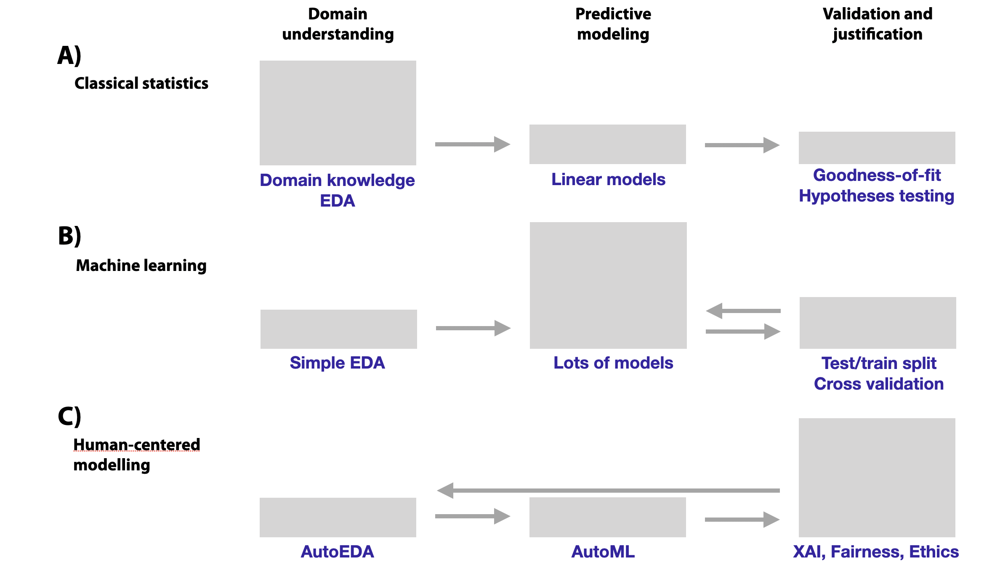

---
output:
  pdf_document: default
  html_document: default
---
# Introduction

**Learning objectives:**

- Introduce the concept of predictive models.

- Detail the evolution of statistical models.

- Highlight the challenges and risks associated with advanced predictive models.

- Emphasize the importance of model exploration tools to:
  - Understand
  - Evaluate
  - Assure ethical compliance

## Purpose of Predictive Models {-}

*Predict values of a variable of interest based on values of other variables*.

$$
Y = f(X) + \epsilon
$$

We can predict:

  - The risk of heart disease based on patient’s characteristics
  - Political attitudes based on Facebook comments
 
## First Stage {-}
  
- The **least squares method** was created by **Legendre in 1805** and by **Gauss in 1809** to be the first **regression model** for predicting _continuous_ variables.

- **Classification models** are used to predict nominal variables and were introduced by **Ronald Fisher in 1936**.

- After that many statistical models have been developed like:
  - Generalized linear models 
  - Classification and regression trees
  - Rule-based models
  
  
## Starting the Big Data Era {-}
  
- As we have **more data** and **more computational power** new models have new capacities:
  - Flexibility
  - Internal variable selection
  - High precision of predictions
  
- Most the models techniques combine **hundreds or thousands** of simpler models into one super-model like happens with:
  - Bagging
  - Boosting
  - Model stacking

- Large deep-neural models may have over a **billion parameters**.


## The Dangers of Black Box Models {-}

- **IBM’s Watson for Oncology** was criticized by oncologists for delivering unsafe and inaccurate recommendations

- **Amazon’s** system for **curriculum-vitae screening** was found to be biased against women.

- Algorithms behind the **Apple Credit Card** are accused of being gender-biased.

> The General Data Protection Regulation (GDPR, 2018)  **creates a right to explanation**


## A New Modeling Process {-}

{width=80% height=80%}

## We need more tools {-}

The true bottleneck in predictive modelling is the lack of tools for **model exploration**:
 
- **Model explanation**: Obtaining insight into model-based predictions.

- **Model examination**: Evaluation of model’s performance and understanding the weaknesses.
 

## Ethics requirements for any predictive model {-}

1. **Prediction’s validation**: One should be able to verify how strong the evidence is that supports the prediction.

2. **Prediction’s justification**: One should be able to understand which variables affect the prediction and to what extent.

3. **Prediction’s speculation**: One should be able to understand how the prediction would change if the values of the variables included in the model changed.


## Terminology {-}

|**Words**|**Equivalent word**|
|:-------:|:-----------------:|
|Independent variables|Explanatory variables <br> Predictors <br> Covariates <br> Input variables <br> Features|
|Dependent variable|Predicted <br> Response <br> Output <br> Target|
|Observations|Instances <br> Cases|
|Fit|Trained|
|Coefficients|Parameters|


## Terminology {-}

- Level of explanation methods:
  - **Instance-level**: They are designed to extract information about the behaviour of a model related to a specific observation (or instance).
  - **Dataset-level**: They allow obtaining information about the behaviour of the model for an entire dataset.

- Types of dependent variables
  - Categorical
  - Continuous
    - Numbers with an ordering ( _age_ or _number of children_ )
    - Counts ( _number of floors_ or _number of steps_ )
  
## Glass-box {-}

It is a model that is easy to understand, as it has:

- A simple structure
  - Decision or regression trees
  - Linear models
- A limited number of coefficients _(not much higher than 10)_


{width=37.5% height=60% fig-align="center"}

## Glass-box benefits {-}

- We can see which explanatory **variables are included** in the model and which **are not**.

- We can easily link **changes in the model's predictions** with changes in particular explanatory variables.

- Allow us to challenge the model on the ground of domain knowledge.

## Model-specific {-}

- For **linear models** and **generalized linear models**
  - qq-plots
  - Diagnostic plots
  - Tests for model structure
  - Tools for identification of outliers

- For **random forest** and **boosting**
  - Out-of-bag method of evaluating performance
  - Variable importance
  - Possible interactions
  
- For **neural networks**
  - Layer-wise relevance propagation technique
  - Saliency maps technique

## Model-specific Limitations {-}

- One cannot easily **compare explanations for two models** with different structures.


{width=60% height=40% fig-align="center"}

## Model-specific Limitations {-}

- We need to create new methods for each new model proposed.


{width=40% height=60% fig-align="center"}

## Model-agnostic techniques {-}

- We don't assume anything about the model structure.

- We will assume that the model operates on p-dimensional vector of explanatory variables/features and, for a single observation, it **returns a single value (score/probability)**, which is a real number.


{width=40% height=80% fig-align="center"}


## Meeting Videos {-}

### Cohort 1 {-}

`r knitr::include_url("https://www.youtube.com/embed/URL")`

<details>
<summary> Meeting chat log </summary>

```
LOG
```
</details>
