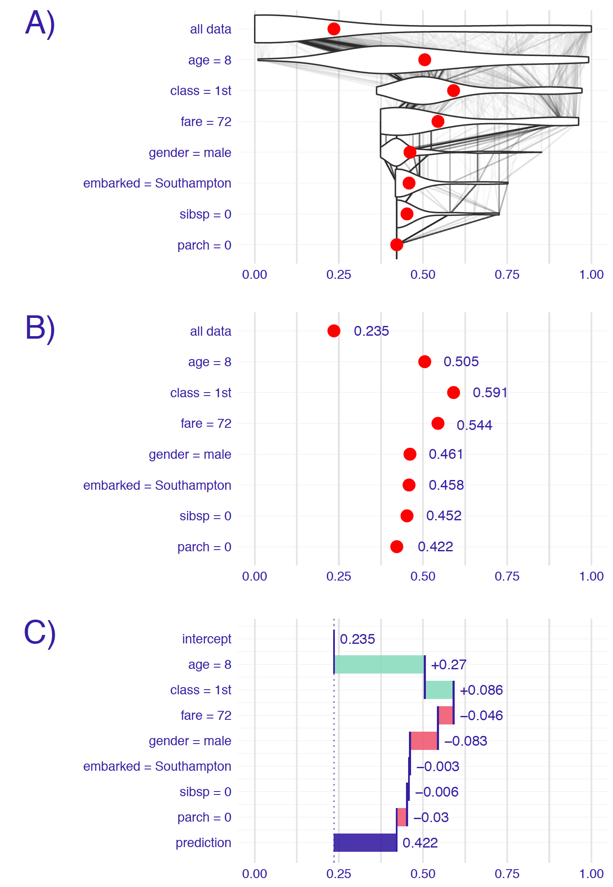
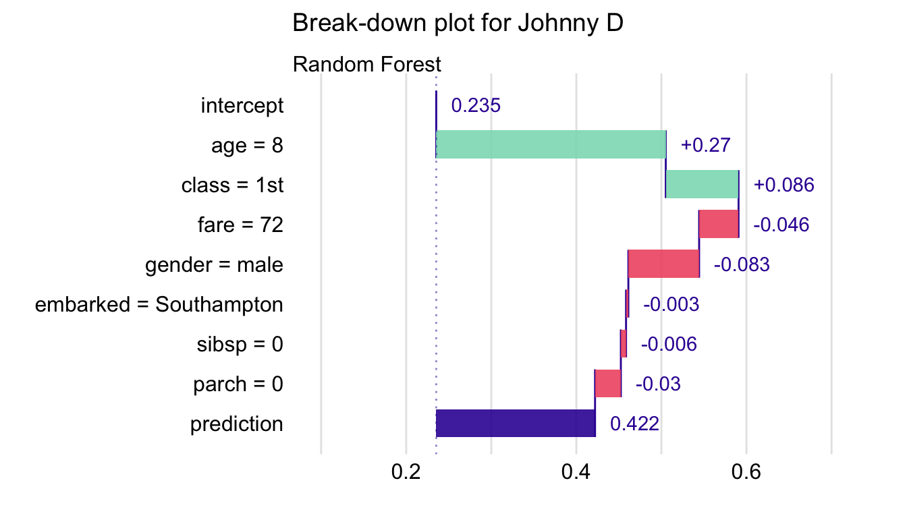

# Break-down Plots for Additive Attributions

**Learning objectives:**

- Introduction to break-down (BD) plots
- Examine individual predictions using the Titanic imputed dataset
- Pros and cons

## Introduction

When trying to understand black-box models, common questions are:

- How the model arrive to the predicted result?
- Which variables contribute the most to the result?

A possible solution is using BD plots to decompose the model’s prediction into contributions that can be attributed to different explanatory variables.

## Intuition

Let's we assume that prediction $f(\underline{x})$ is an approximation of the expected value of the dependent variable $Y$ given values of explanatory variables $\underline{x}$.

So, the underlying idea of BD plots is to capture the contribution of an explanatory variable to the model's prediction by computing the shift in the expected value of $Y$, while fixing the values of other variables. 

The figure below illustrates the prediction obtained for the random forest model for passenger Johnny D, an 8-year-old passenger travelling in the first class.



We can conclude that:

- the mean prediction for the random forest model for the Titanic dataset is equal to 23.5\%.

- The model's prediction for Johnny D is equal to 42.2\%, which is much higher than the mean prediction.

- The two explanatory variables that influence this prediction the most are *age* (with the value equal to 8) and *class* (with the value "1st").

- All other explanatory variables have smaller effects, and they actually reduce the increase in the predicted value induced by *class* and *age*.

## Example: Titanic dataset

Let us consider the random forest model `titanic_rf` and passenger Johnny D  as the instance of interest in the Titanic data.

Table 6.2: Variable-importance measures for the random forest model and Johnny D.

|variable $j$           |  $E_{\underline{X}}\left\{ f(\underline{X}) | \underline{X}^{J} = \underline{x}^{J}_*\right\}$ |  $\Delta^{j|J}(\underline{x}_*)$ |
|:----------------------|-----------:|------------:|
|intercept $(v_0)$      |   0.2353095|    0.2353095|
|age = 8                |   0.5051210|    0.2698115|
|class = 1st            |   0.5906969|    0.0855759|
|fare = 72              |   0.5443561|   -0.0463407|
|gender = male          |   0.4611518|   -0.0832043|
|embarked = Southampton |   0.4584422|   -0.0027096|
|sibsp = 0              |   0.4523398|   -0.0061024|
|parch = 0              |   0.4220000|   -0.0303398|
|prediction             |   0.4220000|    0.4220000|

The results from Table 6.2 are presented in the following BD plot.



## Pros and cons

BD plots offer a model-agnostic approach that can be applied to any predictive model that returns a single number for a single observation (instance).

Advantages:

- Plots are generally easy to understand
- Illustrations are compact

Disadvantages:

- May be misleading for models including interactions (plots only show the additive attributions)
- The choice of the ordering of the explanatory variables that is used in the calculation of the variable-importance measures is important
- For a large number of variables, BD plots may be complex and include many explanatory variables with small contributions to the instance prediction.

## R code examples

[Source](https://modeloriented.github.io/DALEX/articles/vignette_titanic.html)

Load `DALEX` packages
```{r 06-load-Dalex}
suppressMessages(library(DALEX))
```

Load Titanic imputed dataset.
```{r 06-titanic-imputed}
data("titanic_imputed")
head(titanic_imputed)
```

Build a random forest model.
```{r 06-random-forest}
suppressMessages(library(randomForest))
model_titanic_rf <- randomForest(survived ~ gender + age + class + embarked + 
                                   fare + sibsp + parch,  data = titanic_imputed, 
                                 classification = TRUE)

model_titanic_rf
```

Build an explainer object.
```{r 06-explainer}
explain_titanic_rf <- explain(model_titanic_rf, 
                                  data = titanic_imputed,
                                  y = titanic_imputed$survived, 
                                  label = "Random Forest",
                                  colorize = FALSE)
```

Create a dataframe for Johnny D passenger
```{r 06-new-passenger}
new_passenger <- data.frame(
     class = factor("1st", levels = c("1st", "2nd", "3rd", "deck crew", "engineering crew", "restaurant staff", "victualling crew")),
     gender = factor("male", levels = c("female", "male")),
     age = 8,
     sibsp = 0,
     parch = 0,
     fare = 72,
     embarked = factor("Southampton", levels = c("Belfast", "Cherbourg", "Queenstown", "Southampton"))
)
```

Decompose model prediction with `predict_parts()`
```{r 06-predict-parts}
sp_rf <- predict_parts(explain_titanic_rf, new_passenger)
sp_rf
```

BD plot
```{r 06-bd-rf-plot}
plot(sp_rf)
```

`order` argument
```{r 06-bd-order}
bd_rf_order <- predict_parts(explainer = explain_titanic_rf,
                       new_observation = new_passenger, 
                                  type = "break_down",
                   order = c("class", "age", "gender", "fare", 
                             "parch", "sibsp", "embarked"))

plot(bd_rf_order, max_features = 3)
```

`keep_distributions` argument
```{r 06-keep-distributions}
bd_rf_distr <- predict_parts(explainer = explain_titanic_rf,
                       new_observation = new_passenger, 
                                  type = "break_down",
              order = c("age", "class", "fare", "gender", 
                        "embarked", "sibsp", "parch"),
                    keep_distributions = TRUE)

plot(bd_rf_distr, plot_distributions = TRUE)
```

## Meeting Videos {-}

### Cohort 1 {-}

`r knitr::include_url("https://www.youtube.com/embed/URL")`

<details>
<summary> Meeting chat log </summary>

```
LOG
```
</details>
