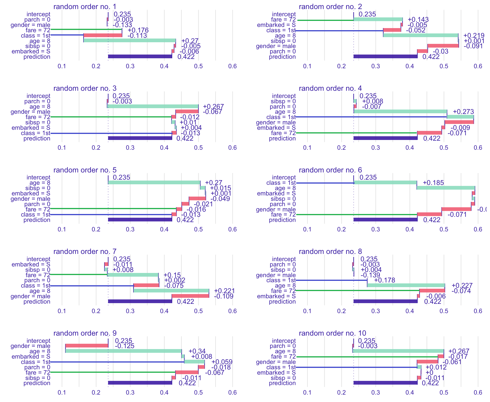
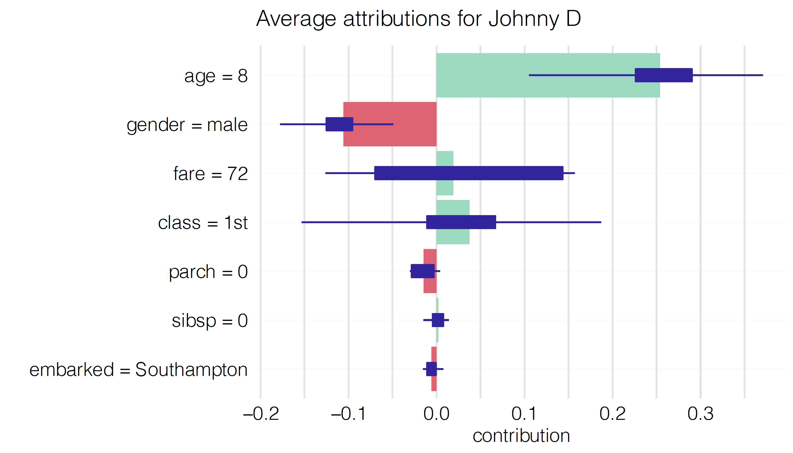
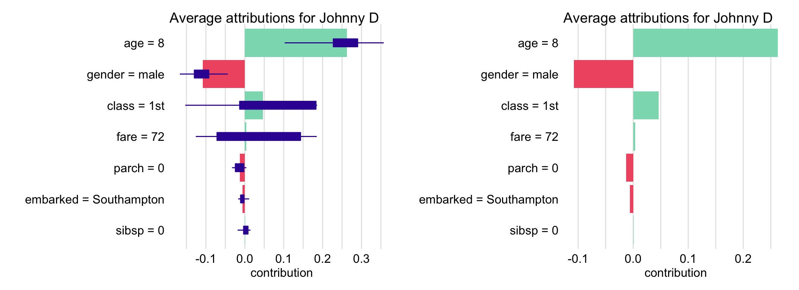
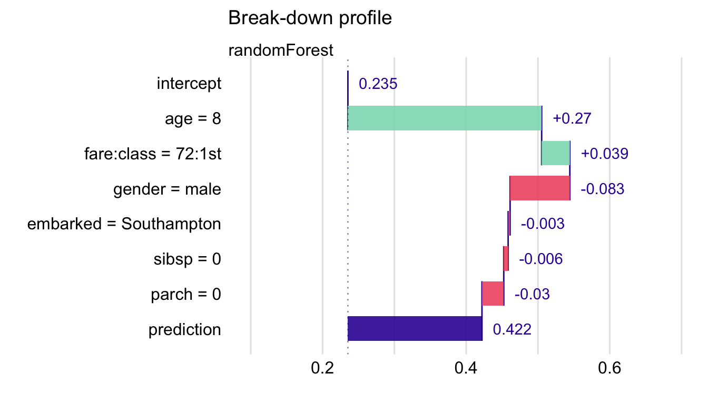
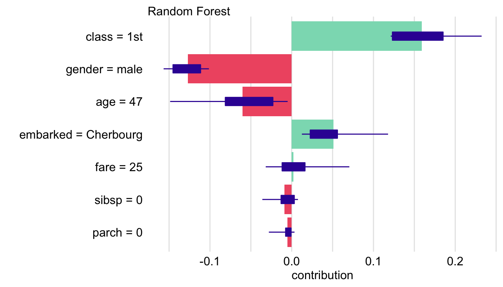

# Shapley Additive Explanations (SHAP) for Average Attributions

**Learning objectives:**

- Introduce another approach to **address the ordering issue** by **averaging the value of a variable's attribution** over all (or a large number of) possible orderings.

## Applying random order to BD plots {-}

**`fare` and `class` change a lot.**



## fare and class summary {-}

```{r, echo=FALSE,fig.align='center', fig.dpi=300}
library(ggplot2)
library(data.table)

FocusVars <- c("Fare","Class")

FocusVarsColors <- c("forestgreen", "blue")
names(FocusVarsColors) <- FocusVars

FareClassDt <-
  data.table(order = rep(1:10, 2),
             variable = factor(rep(FocusVars, each = 10),
                               levels = FocusVars),
             value = c(
               # fare
               0.176, 0.143, -0.012, -0.071, -0.016,
               -0.071, 0.015, -0.074, -0.067, -0.017,
               
               # class
               -0.113, -0.052, -0.013, 0.07, -0.013,
               0.185, -0.075, 0.178, 0.059, 0.012
             ) )

ggplot(FareClassDt, aes(order, value, color = variable))+
  geom_line()+
  geom_point(size = 2.5)+
  geom_hline(yintercept = 0,
             linetype = 5)+
  scale_x_continuous(breaks = scales::breaks_width(1))+
  scale_y_continuous(breaks = scales::breaks_width(0.05))+
  scale_color_manual(values = FocusVarsColors) +
  facet_wrap(~ variable, ncol = 1)+
  theme_minimal()+
  theme(strip.text = element_text(face = "bold", size = 12),
        axis.text = element_text(color = "grey53", size = 11),
        panel.grid = element_line(color = "grey90"),
        legend.position = "none",
        panel.grid.minor.x = element_blank())
```

## Mean value of the attributions {-}

To remove the influence of the ordering of the variables.

```{r, echo=FALSE, fig.align='center'}
FareClassDt[, .(mean_value = mean(value)),
            by = variable] |>
  flextable::flextable() |>
  flextable::fontsize(size = 16, part = "all") |>
  flextable::theme_alafoli() |>
  flextable::color(color = "black", part = "header") |>
  flextable::bold(part = "header")
```



## SHAP description {-}

**SH**apley **A**dditive ex**P**lanations (**SHAP**) are based on "Shapley values" developed by Shapley.

**Shapley problem description**

- Some players cooperates and obtains **a certain overall gain** from the cooperation.
- The cooperation may bring **more benefit than individual actions**.
- How to **distribute the generated surplus** among the players if **not all players are identical** is the problem to solve.


## SHAP description {-}

**Let’s translate this problem**

- Explanatory variables are the players.
- $f()$ plays the role of the coalition.
- The payoff from the coalition is the model's prediction.
- The problem to solve is how to **distribute the model's prediction** across particular variables.


## Calculating Shapley Values {-}

- $p!$: The total number of possible permutations (or orderings) of these variables.
- $J$: A possible permutation of the set of explanatory variables $\{1,2,\ldots,p\}$ included in the model $f()$.
- $\pi(J,j)$: Set of the indices of the variables that are positioned in $J$ **before** the $j$-th variable.
- $\Delta^{j|\pi(J,j)}(\underline{x}_*)$: The variable-importance measure of $j$ due the variables that have been used before (*constant for all permutations $J$*)

**Average of the variable-importance measures across all possible orderings of explanatory variables**

$$
\varphi(\underline{x}_*,j) = \frac{1}{p!} \sum_{J} \Delta^{j|\pi(J,j)}(\underline{x}_*)
$$

> For a large $p$ we can use Monte Carlo estimator


## Important properties {-}

1. If two explanatory variables $j$ and $k$ are **interchangeable**, then their Shapley **values are equal**

$$
\varphi(\underline{x}_*,j) = \varphi(\underline{x}_*,k)
$$

2. If an explanatory variable $j$ **does not contribute** to any prediction for any set of explanatory variables, then its Shapley **value is equal to 0**:

$$
\varphi(\underline{x}_*,j) = 0.
$$

3. If model $f()$ is a sum of two other models $g()$ and $h()$, then the Shapley value calculated for model $f()$ is a sum of Shapley values for models $g()$ and $h()$.

4. The sum of Shapley values is equal to the model's prediction.

$$
f(\underline{x}_*) - E_{\underline{X}}\{f(\underline{X})\} = \sum_{j=1}^p	\varphi(\underline{x}_*,j), 
$$


## Example: Johnny D {-}

For the random forest model `titanic_rf` and the Titanic data based on **25 random orderings**.

```{r}
scales::percent(25/factorial(7),
                accuracy = 0.01)
```


|Variable      | Shapley value|
|:-------------|------------:|
|age = 8       |    0.2525   |
|class = 1st   |    0.0246   |
|embarked = Southampton |   -0.0032   |
|fare = 72     |    0.0140   |
|gender = male |   -0.0943   |
|parch = 0     |   -0.0097   |
|sibsp = 0     |    0.0027   |


## Example: Johnny D {-}




## Example: Johnny D {-}




## Pros and cons {-}

|**Pros**|**BD Plots**|**iBD plots**|**Shapley values**|
|:-------|:----------:|:-----------:|:----------------:|
|Not Time-consuming for large models              |X| | |
|Easy to understand                               |X|X|X|
|Good for models including interactions           | |X| |
|Helps to avoid false-positive findings           | | |X|
|Easy to understand with large number of variables| | | |


## Code snippets {-}

1. Retrieve the `titanic_rf` model-object

```{r}
titanic_imputed <- archivist::aread("pbiecek/models/27e5c")
titanic_rf <- archivist:: aread("pbiecek/models/4e0fc")
henry <- archivist::aread("pbiecek/models/a6538")
```

## Code snippets {-}

2. Construct the explainer for the model

```{r, warning=FALSE, message=FALSE,include=FALSE}
library("randomForest")
library("DALEX")
explain_rf <- DALEX::explain(model = titanic_rf,  
                             data = titanic_imputed[, -9],
                             y = titanic_imputed$survived == "yes", 
                             label = "New Random Forest")
```

```r
library("randomForest")
library("DALEX")
explain_rf <- DALEX::explain(model = titanic_rf,  
                             data = titanic_imputed[, -9],
                             y = titanic_imputed$survived == "yes", 
                             label = "New Random Forest")
```


```{r}
predict(explain_rf, henry)
```


## Code snippets {-}

3. Compute Shapley values for Henry

```{r}
set.seed(11)

shap_henry <- predict_parts(explainer = explain_rf, 
                            new_observation = henry, 
                            type = "shap",
                            B = 25)

shap_henry
```

## Code snippets {-}

4. Plot the results.

```r
plot(shap_henry, show_boxplots = TRUE)
```


```{r,figures-side, fig.show="hold", out.width="50%", echo=FALSE}
plot(shap_henry, show_boxplots = TRUE)


```


## Meeting Videos {-}

### Cohort 1 {-}

`r knitr::include_url("https://www.youtube.com/embed/URL")`

<details>
<summary> Meeting chat log </summary>

```
LOG
```
</details>
