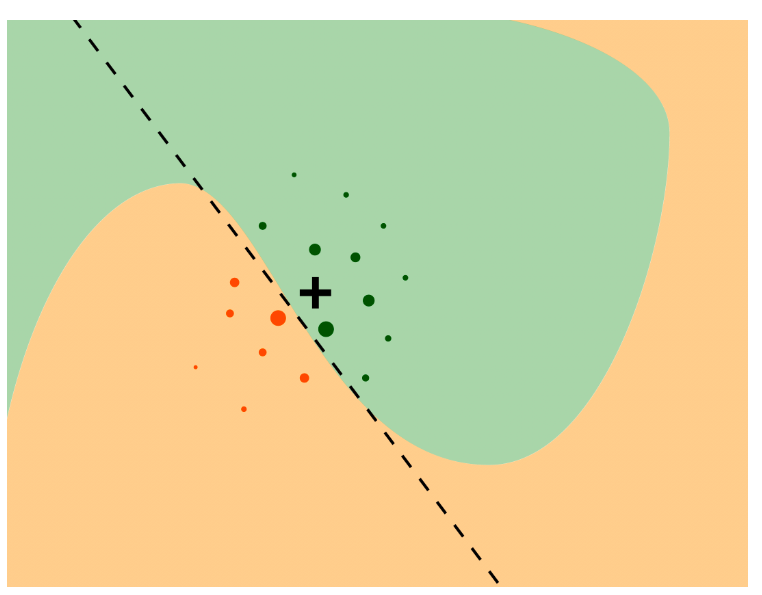
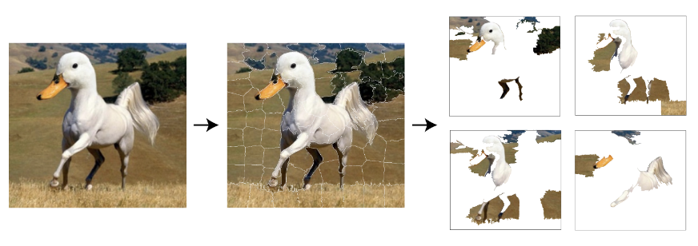
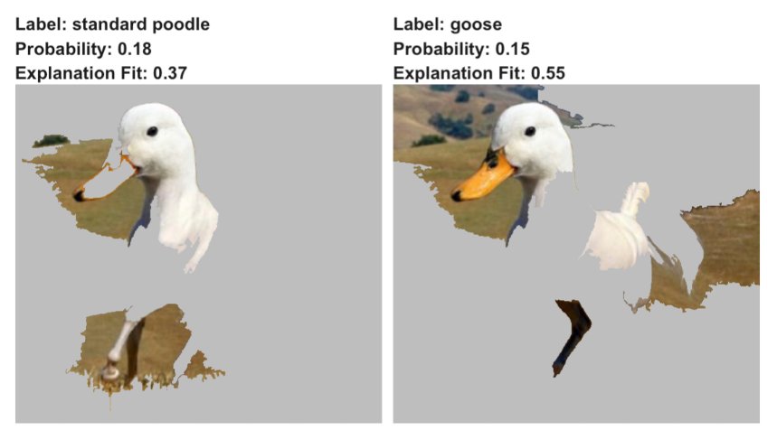
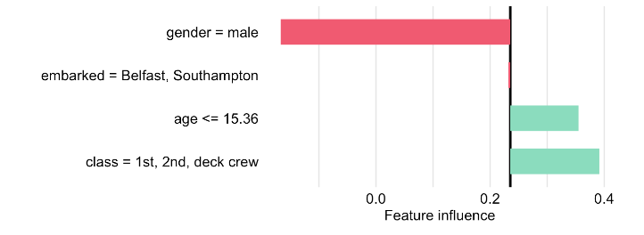

# Local Interpretable Model-agnostic Explanations (LIME)

**Sections:**

- Overview  
- Intuition  
- Method  
- Titanic data  
- Pros and Cons  
- R Examples 

## Overview {-}  
  
* Recap of previous methods for instance-level explanation  
  - Break-down plots (with and without interactions)  
  - Shapley Additive Explanations (SHAP)  
  
* Previous approaches may be problematic with large set of predictors
  - Too complex for human comprehension
  - Computational times  
    
* Introducing LIME
  - Recent method (first published in 2016)  
  - Replace black-box model with glass-box model  
  - Sparse explanations

## Intuition  
  
**Binary classifier Example**  

**  

  
Plot description:  

* Axes represent values for two separate features  
* Colors represent binary predictions from black-box classifier  
* Cross indicates instance of interest
* Dots represent artificial generated points  
* Dot size corresponds to distance to instance of interest  
* Dashed line is linear glass-box model fit to artificial points  
  
**Common Glass Box Models**  
  
* LASSO  
* Decision trees  

## Method  
 
**Loss Function Minimization**  
  
$$
\hat g = \arg \min_{g \in \mathcal{G}} L\{f, g, \nu(\underline{x}_*)\} + \Omega (g), 
$$
where  
  
* $\mathcal{G}$ is class of simple models  
* $f$ is black box model prediction  
* $g$ is glass box model prediction  
* $\nu(\underline{x}_*)$ is neighborhood around instance $\underline{x}_*$  
* $\Omega (g)$ is penalty for complexity of $f$  
  
In practice, exclude $\Omega (g)$ from optimization procedure. Instead, manually control complexity by specifying number of coefficients in glass-box model.  
  
f() and g() operate on different spaces:  
  
* f() works in $p$ dimensions, corresponds to $p$ predictors  
* g() corresponds to $q$ dimensional spaces  
* $q << p$  
  
**Glass-box Fitting Procedure** 
  

```  
Specify:
  - x* instance of interest
  - N sample size of artificial points 
  - K number of predictor variables for glass-box model
  - similarity function
  - glass box model
    
Steps:    
1. Sample N artificial points around instance.   
2. Fit black box model to points -- becomes target variable
3. Calculate similarity between instance and each artifical point
4. Fit glass box model:  
    -use N artificial points as features
    -use black-box predictions on N points as target
    -limit to K nonzero coefficients
    -Weight training of each point using similarity measure 

```
  
**Image Classifier Example**  

Overview:  
  
* Classify 244 x 244 color image into 1,000 potential categories  
* Goal: Explain model classification. 
* Issue: High dimensional problem: Each image comprises 178,608 dimensions (3 x 244 x 244)  
  
Solution:  
  
* Transform into 100 superpixels. Glass box applies to $\{0,1\}^{100}$ space
* Sample around instance - (i.e.,randomly exclude some superpxiels)
* Fit LASSO with K=15 nonzero coefficients

**  
*Figure 9.3: Left-original image; Middle-superpixels; Right-artificial data*  
  
**  
*Figure 9.4: 15 selected superpixel features*  

**Sampling around instance**  
  
* Can't always sample from existing points because data very sparse and "far" from each other in high dimensional space  
* Usually instead create perturbations on instance of interest  
  + continuous variables - multiple approaches
      - adding Gaussian noise  
      - perturb discretized versions of of variables
  + binary variables - change some 0s to 1s and vice-versa  
    
## Titanic Data Example  
  
**Create Interpretable Data Space**  
  
* Combine similar concepts  
  + group *class* and *fare* into "wealth"   
  + combine *age* and *gender* into "demographics"  
* Simpler approach for this example - discretize every variable into two levels  
  + *age* bucketed into "<= 15.36" and > 15.36
  + *class* into "1st/2nd/deck crew" and "other"  

**LIME Applied to Johnny D**  
**  
*Figure 9.5: Johnny D LIME, LASSO, K=3*  


## Pros and Cons  

**Pros**  
  
* Model agnostic  
* Interpretable explanation  
* Local fidelity  
* Great for text and image analysis  
  
**Cons**  
  
* No consensus for best lower dimensional representations for continuous and category predictors
* Multiple implementations, so may get different results based on package used  
* Glass box model fit to black-box predictions, not actual data, so quality of local fit may be misleading  
* Finding an appropriate neighborhood difficult with high dimensional data  
  

## Code Examples in R  
  
**Package options**  
  
* `lime` is port of Python library, discretizes variables based on quartiles  
* `localModel` uses ceteris-paribus profiles, 
* `iml` works directly on continuous variables. One of package authors wrote popular interpretable ML book  
  
**Notes:**  

* `DALExtra` package needed for `predict_surrogate()` interface to multiple packages.  
* Default method of`predict_surrogate()` is `localModel`.  
* Examples below use K-LASSO for glass-box model  
  

```{r 09-load-data, warning=FALSE,message=FALSE}
# core libraries
library(randomForest)
library(DALEX)
library(DALEXtra)

# load data nd models 
titanic_imputed <- archivist::aread("pbiecek/models/27e5c")
titanic_rf <- archivist:: aread("pbiecek/models/4e0fc")
johnny_d <- archivist:: aread("pbiecek/models/e3596")  

# explainer
titanic_rf_exp <- DALEX::explain(model = titanic_rf,  
                        data = titanic_imputed[, -9],
                           y = titanic_imputed$survived == "yes", 
                       label = "Random Forest")

```  
  
**Package: lime**  
  
Fit model:  

```{r lime-package,warning=FALSE, message=FALSE}
library(lime)
set.seed(1)

# lime model
model_type.dalex_explainer <- DALEXtra::model_type.dalex_explainer
predict_model.dalex_explainer <- DALEXtra::predict_model.dalex_explainer

lime_johnny <- predict_surrogate(explainer = titanic_rf_exp, 
                  new_observation = johnny_d, 
                  n_features = 3, 
                  n_permutations = 1000,
                  type = "lime")
```

```{r lime-out,echo=FALSE}
# output
lime_johnny |>
  dplyr::mutate_if(is.numeric,round,3) |> 
  knitr::kable() |> 
  kableExtra::kable_styling(font_size=11)
  
```
  
Interpretable equation:  

$$
\hat p_{lime} = 0.557 - 0.395 \cdot 1_{male} + 0.173 \cdot 1_{age <= 22}  + 0.146 \cdot 1_{class = 1st}=0.481,
$$
Plot `lime` model:

```{r lime-plot}
plot(lime_johnny)
```
  
**Package: localModel**  
  
```{r localmodel, warning=FALSE, message=FALSE}
library(localModel)

# localModel build
locMod_johnny <- predict_surrogate(explainer = titanic_rf_exp, 
                  new_observation = johnny_d, 
                  size = 1000,
                  seed = 1,
                  type = "localModel")
```  
  
```{r localmodel-out, echo=FALSE}
# output 
locMod_johnny[,1:3] |> 
  dplyr::mutate_if(is.numeric,round,3) |>  
  knitr::kable()
```

Plot to explain how continuous `age` variable was dichotomized:  

```{r localModel-age-discrete}
# plot
plot_interpretable_feature(locMod_johnny, "age")

```  
  
Glass-box explanation plot for Johnny D:  

```{r localmodel-plot}
plot(locMod_johnny)
```
    
**Package: iml**  
  
```{r iml, warning=FALSE,message=FALSE}
library(iml)

# model using iml pacakge
iml_johnny <- predict_surrogate(explainer = titanic_rf_exp, 
                  new_observation = johnny_d, 
                  k = 3, 
                  type = "iml",
                  seed=1)
```

```{r iml-out, echo=FALSE}
# output - only output for probability of survival
iml_johnny$results[,c(1:5,7)] |> 
  dplyr::mutate_if(is.numeric,round,3) |>  
  dplyr::filter(.class == "yes") |> 
  knitr::kable()
```  

Notes:  

* continuous variables are not transformed    
* categorical variables dichotomized with value 1 for observed category; otherwise 0  

Glass-box explanation plot for Johnny D:  

```{r iml-plot}
plot(iml_johnny)
```

The `age`, `gender` and `class` are correlated, and may partially explain why explanations are somewhat different across various LIME implementations.  
   


## Meeting Videos {-}

### Cohort 1 {-}

`r knitr::include_url("https://www.youtube.com/embed/huz9bVCMtrE")`
