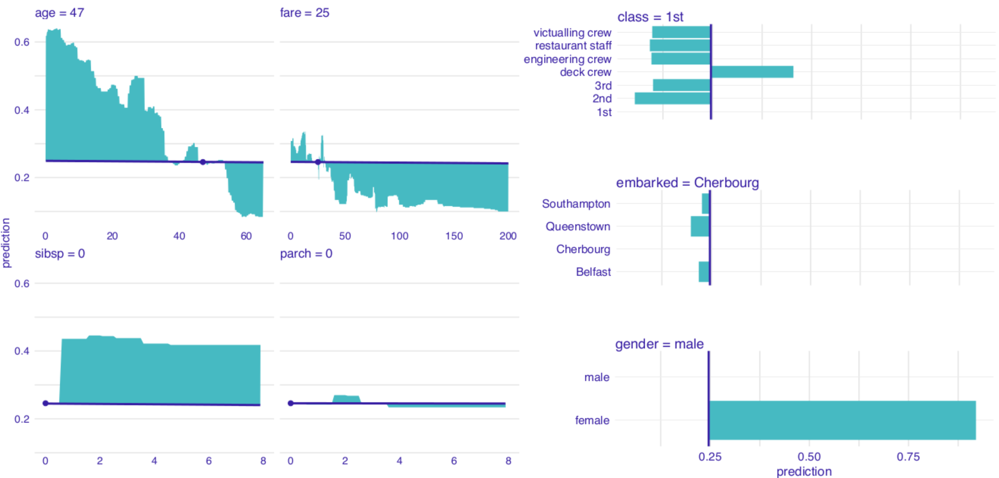
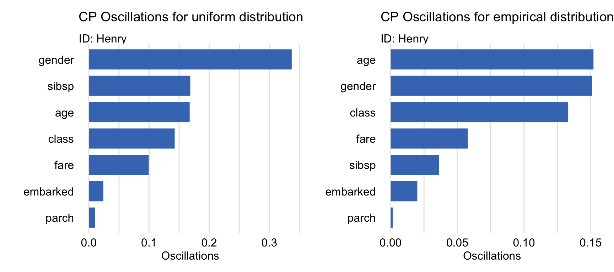
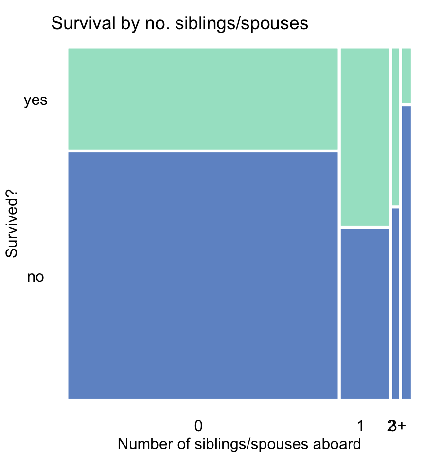
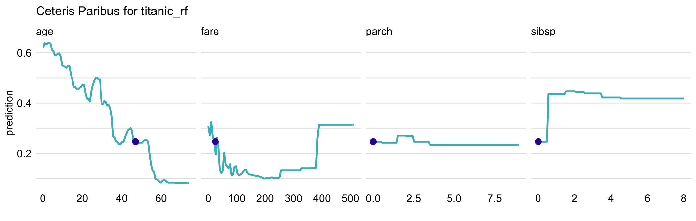

# Ceteris-paribus Oscillations

**Learning objectives:**

- Describe a measure to identify the most interesting or important profiles.


## Basic idea {-}

1. If an explanatory variable has a **large influence** on prediction for a particular instance, then its corresponding CP profile must present **large fluctuations**.

2. If an explanatory variable has **little influence** on prediction for a particular instance, then its corresponding CP profile must present **bare fluctuations** and be close to the **original prediction of the model**.
  - The **sum of differences** between the **profile** and the **prediction** _(across all possible values of the explanatory variable)_ should be close to zero.
  
## Graphical representation {-}
  
The sum of differences can be represented by the **area** between the **profile** and the **line at prediction level**.

<br>

{width=75% height=75%}

## Method {-}

**Remember**, one-dimensional CP profile for all possible values $z$ of the explanatory variable $j$ based the interest observation $\underline{x}_*$.

$$
h^{j}_{\underline{x}_*}(z) \equiv f\left(\underline{x}_*^{j|=z}\right).
$$

$vip_{CP}^j(\underline{x}_*)$ is the **expected absolute deviation** of the **CP profile** $h^{j}_{\underline{x}_*}()$ from the **model's prediction** $f(\underline{x}_*)$, computed over the distribution $g^j(z)$ of the $j$-th explanatory variable.


$$
vip_{CP}^j(\underline{x}_*) = \int_{\mathcal R} |h^{j}_{\underline{x}_*}(z) - f(\underline{x}_*)| g^j(z)dz=E_{X^j}\left\{|h^{j}_{\underline{x}_*}(X^j) - f(\underline{x}_*)|\right\}.
$$

## Method challenge {-}

The **true distribution** of $j$-th explanatory variable is **unknown** and we have 2 alternatives:

1. To assume that $g^j(z)$ is a **uniform distribution** over the range of variable $X^j$ for $k$ selected values _(all unique or equidistant grid)_ of the $j$-th explanatory variable.

$$
\widehat{vip}_{CP}^{j,uni}(\underline{x}_*) = \frac 1k \sum_{l=1}^k |h^{j}_{x_*}(z_l) - f(\underline{x}_*)|
$$

2. To use **all observations** in the dataset $n$ to estimate the **empirical distribution** of $X^{j}$, despite it might require more **computation time**.

$$
\widehat{vip}_{CP}^{j,emp}(\underline{x}_*) = \frac 1n \sum_{i=1}^n |h^{j}_{\underline{x}_*}(x^{j}_i) - f(\underline{x}_*)|
$$

## Local vs global importance {-}

Let's assume a simple model described as the interaction of $X^1$ and $X^1$ in values from 0 to 1 $[0,1]$.

$$
f(x^1, x^2) = x^1 * x^2
$$

- Globally both variables are **equally important**, because the model is symmetrical.

- But if the instance we want to explain $\underline{x}_*$ has $x^1 = 0$ and $x^2 = 1$. Then the importance of $X^1$ is **larger** than $X^2$:
  - $h^1_{x_*}(z) = z$ as $x^2 = 1$ for any value of $z$.
  - $h^2_{x_*}(z) = 0$ as $x^1 = 0$ for any value of $z$.
  
## Example: Henry - random forest model {-}

Both alternatives suggest that the most important variables are **gender** and **age**, followed by **class**.

{width=75% height=75%}

## Example: Henry - random forest model {-}

The **sibsp** variable gains in relative importance for estimator $\widehat{vip}_{CP}^{j,uni}(\underline{x}_*)$ as it has a very **skewed distribution**.

{width=40% height=40%}

## Example: Henry - random forest model {-}

It does not describe how do the variables influence the prediction.

- If Henry were older, this would significantly lower his probability of survival.
- Henry not travelling alone, this would increase his chances of survival. 

{width=80% height=80%}

## Pros and cons {-}

|**Pros**|**BD Plots**|**iBD plots**|**Shapley values**|**LIME**|**CP profiles + oscillations**|
|:----------------------------------------------------|:-:|:-:|:-:|:-:|:-:|
|Good for correlated explanatory variables            | | | | | |
|Not time-consuming for large models                  |X| | |X|-|
|Sum up to the instance prediction                    |X|X|X| | |
|Good for models including interactions               | |X| | | |
|Helps to avoid false-positive findings               | | |X| |X|
|Easy to understand with large number of variables    | | | |X|X|
|Useful tool for sensitivity analysis                 | | | | |X|

## Loading the data and model {-}

```{r}
titanic_imputed <- archivist::aread("pbiecek/models/27e5c")
titanic_rf <- archivist:: aread("pbiecek/models/4e0fc")
(henry <- archivist::aread("pbiecek/models/a6538"))
```

## Creating the explainer {-}

```{r, message=FALSE, warning=FALSE}
library("randomForest")
library("DALEX")
explain_rf <- DALEX::explain(model = titanic_rf,
                             data = titanic_imputed[, -9],
                             y = titanic_imputed$survived == "yes", 
                         label = "Random Forest")
predict(explain_rf, henry)
```

## Creating oscillations uniform {-}

```{r}
oscillations_uniform <- predict_parts(explainer = explain_rf, 
                                      new_observation = henry, 
                                      type = "oscillations_uni")
oscillations_uniform
```

## Plotting uniform results {-}

```{r}
oscillations_uniform$`_ids_` <- "Henry"
plot(oscillations_uniform) +
  ggplot2::ggtitle("Ceteris-paribus Oscillations", 
                   "Expectation over uniform distribution (unique values)")
```

## Plotting empirical results {-}

```{r}
predict_parts(explainer = explain_rf, 
              new_observation = henry, 
              type = "oscillations_emp") |>
  dplyr::mutate(`_ids_` = "Henry") |>
  plot() +
  ggplot2::ggtitle("Ceteris-paribus Oscillations", 
                   "Expectation over empirical distribution") 
```


## Applying a custom grid {-}

```{r}
oscillations_equidist <- predict_parts(explain_rf, henry, 
                                       variable_splits = list(age = seq(0, 65, 0.1),
                                                              fare = seq(0, 200, 0.1),
                                                              gender = unique(titanic_imputed$gender),
                                                              class = unique(titanic_imputed$class)), 
                                       type = "oscillations")
oscillations_equidist
```

## Plotting custom grid {-}

```{r}
oscillations_equidist$`_ids_` <- "Henry"
plot(oscillations_equidist) + 
  ggplot2::ggtitle("Ceteris-paribus Oscillations", 
                   "Expectation over specified grid of points")

```

## Meeting Videos {-}

### Cohort 1 {-}

`r knitr::include_url("https://www.youtube.com/embed/URL")`

<details>
<summary> Meeting chat log </summary>

```
LOG
```
</details>
