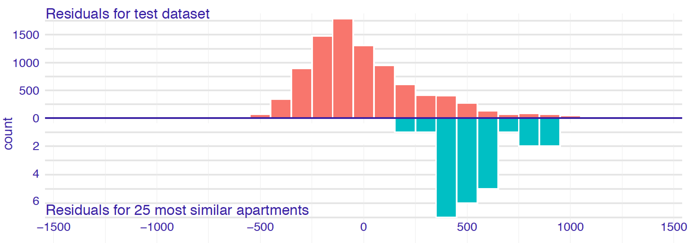
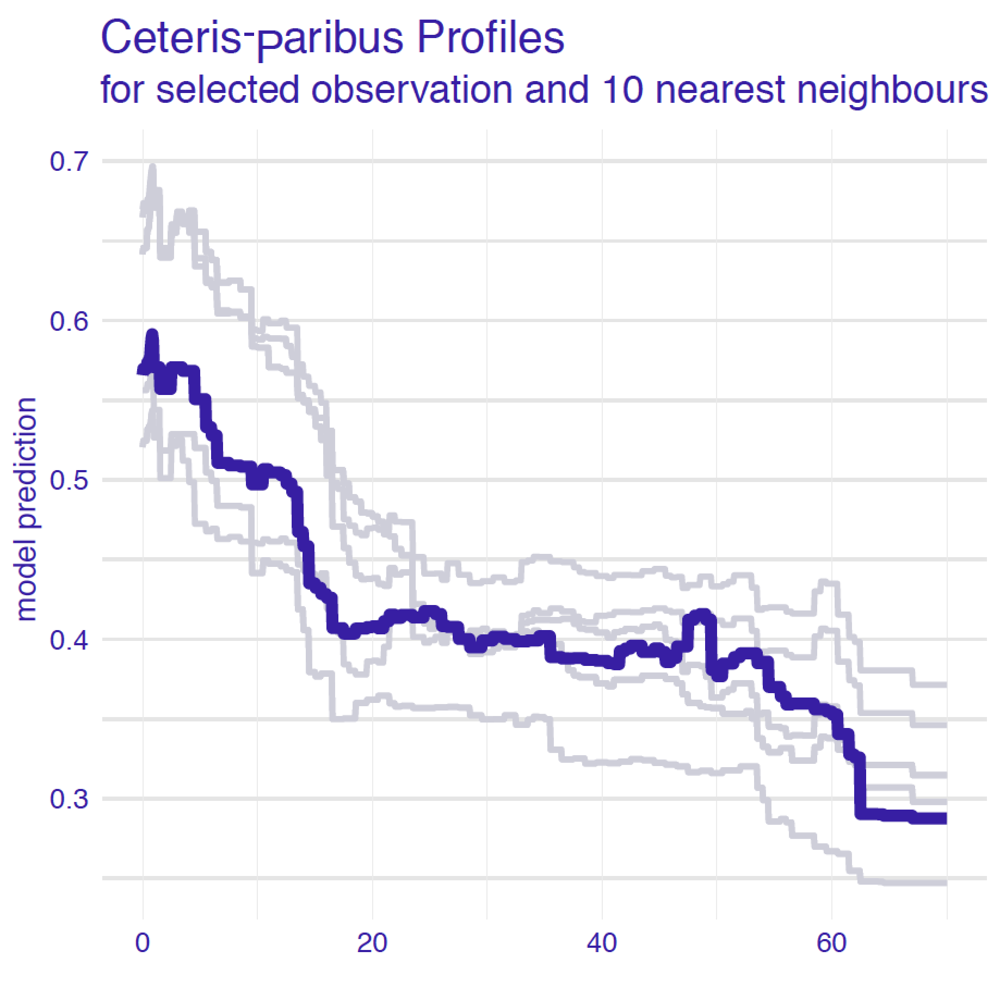
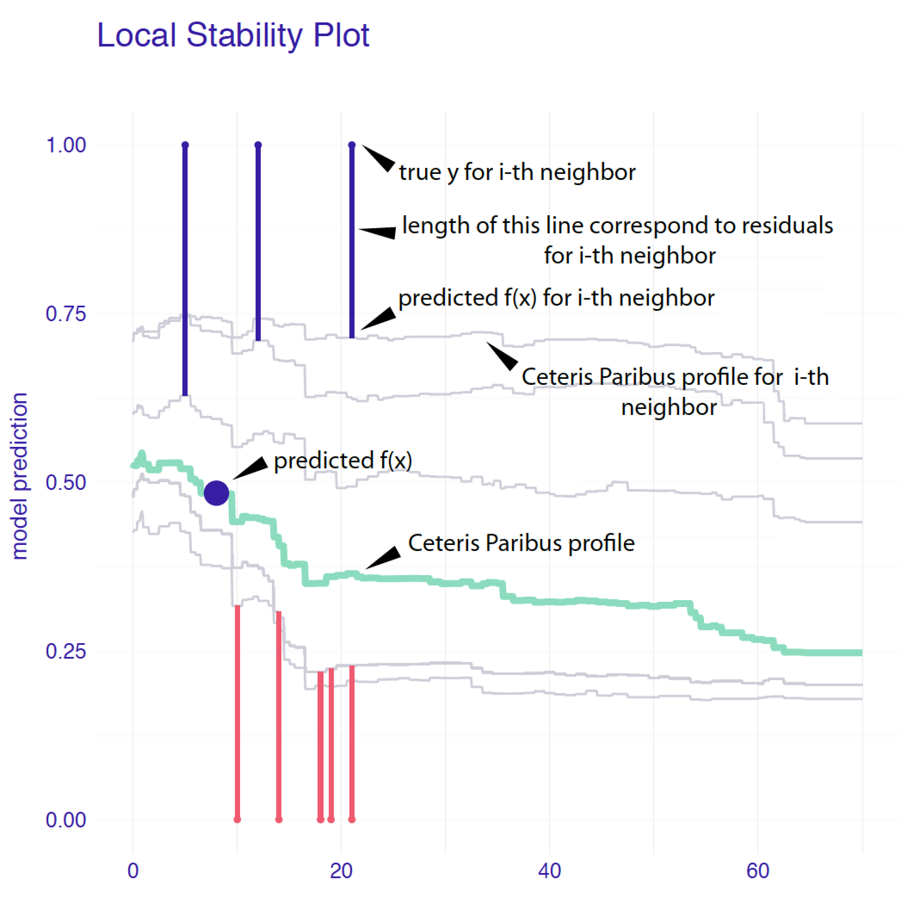
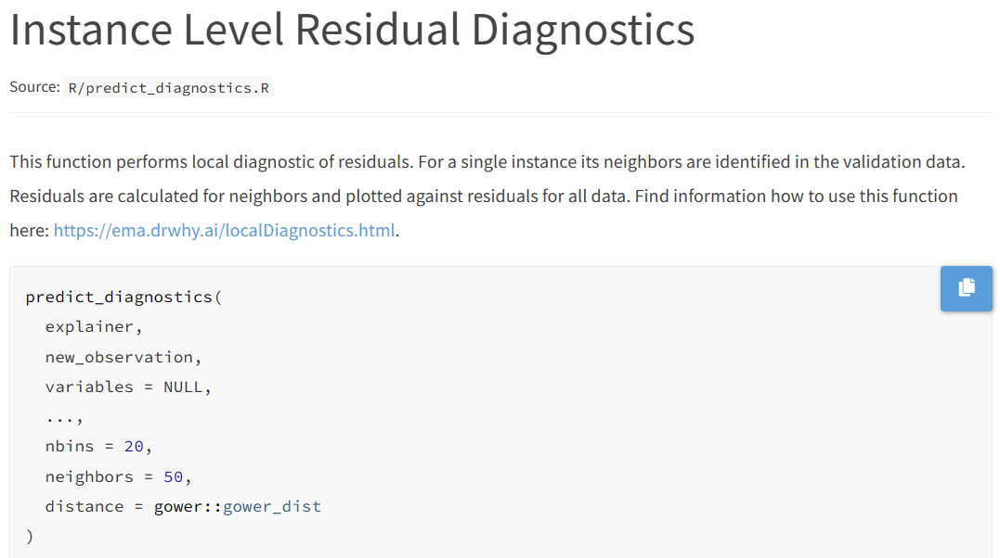

# Local-diagnostics Plots

**Introduction**

If a model presents a satisfactory **overall predictive performance**, but it's less accurate in some observations. Then we can say that the model **does not cover well** some areas of the **input space**.

Local-diagnostics techniques:

- *Local-fidelity plots* evaluate the local **predictive performance** of the model around the observation of interest.

- *Local-stability plots* assess the (local) **stability of predictions** around the observation of interest.


## Intuition {-}

1. Let's select a subset of observations **similar** to observation of interest, also known as **neighbours**.

2. Now, we can compare the distribution of **residuals** of the **neighbours** and the entire training dataset _except for neighbours_ by creating a **local-fidelity plots** or running a **statistical tests**.

\begin{equation}
r_i = y_i - f(x_i) = y_i - \hat y_i
\end{equation}

3. We can also check how the "small differences" in explanatory variables (present in the **neighbours**) can influence on the predictions across the range of each variable by comparing the **CP profiles** of each observation by creating **local-stability plots**.


## Local-fidelity plot example {-}

|**Characteristic**|**Entire dataset**|**25 neighbours**|
|----:|:------:|:----------:|
|Centred around|0|500|
|Conclussion|The model is not biased|The model is biased towards values smaller|

<br>

<div style="text-align:center">

{width=85% height=85%}

</div>

## CP profile example {-}

- The chart represent the instance of interest and its **10 nearest neighbours**.
- The profiles are almost parallel ( _only 5 different ones are visible_ ).

<div style="text-align:center">

{width=40% height=40%}

</div>

<br>

***Note***: _Focus on the variables that are the most important_.

## Local-stability example {-}

By adding **residuals**, we can confirm that there are positive and negative values, so the **prediction should not be biased**.

Some important characteristics to highlight:

- For **additive models**: CP profiles will be approximately parallel.
- For a model with **stable predictions**: CP profiles should be close to each other.


<div style="text-align:center">

{width=40% height=40%}
</div>

## Method: Nearest neighbours {-}

There are two important questions:

- **How many** neighbours should we choose?
  - Less neighbours $=$ more local is the analysis.
  - More neighbours $=$ less variability of the results.
  - Having about 20 neighbours could work fine (depending on dataset size). 

- **What metric** should be used to measure the "proximity" of observations?
  - If the data is numeric we could use:
    - Euclidean distance
    - Manhattan distance
    - Minkowski distance
    - Chebyshev distance
    - Cosine similarity
  - As we have **more predictors** then the **results will change** from metric to metric.

## Method: Gower similarity measure {-}

- **Pro**: It can be used for vectors with both categorical and continuous variables.
- **Con**: It takes into account neither **correlation** between variables nor **variable importance**.

\begin{equation}
d_{gower}(\underline{x}_i, \underline{x}_j) = \frac{1}{p} \sum_{k=1}^p d^k(x_i^k, x_j^k)
\end{equation}

For a continuous variable:

$$
d^k(x_i^k, x_j^k)=\frac{|x_i^k-x_j^k|}{\max(x_1^k,\ldots,x_n^k)-\min(x_1^k,\ldots,x_n^k)},
$$

For a categorical variable:

$$
d^k(x_i^k, x_j^k)=1_{x_i^k \neq x_j^k}
$$
  
## Pros and cons {-}

**Local-fidelity**

- Plots are useful in checking whether the **model-fit** for the instance of interest is unbiased, as in that case the **residuals should be small** and their distribution should be **symmetric around 0**.


**Local-stability**

- Plots may be very helpful to check if the model is ***locally additive** as in does models CP profiles **should be parallel**.

- Plots can allow assessment whether the model is **locally stable** as models CP profiles **should be close to each other**.


**Limitation**

- Both plots are quite **complex** and **lack objective measures** of the quality of the model-fit.

## Getting data and models {-}

```{r}
titanic_imputed <- archivist::aread("pbiecek/models/27e5c")
titanic_rf <- archivist:: aread("pbiecek/models/4e0fc")
(henry <- archivist::aread("pbiecek/models/a6538"))
```

## Creating model explainer {-}

```{r message=FALSE}
library("randomForest")
library("DALEX")

explain_rf <- DALEX::explain(model = titanic_rf,  
                             data = titanic_imputed[, -9],
                             y = titanic_imputed$survived == "yes", 
                             label = "Random Forest")

predict(explain_rf, henry)
```


## predict_diagnostics function {-}

If the `residual_function` argument of the `explain()` function is applied with the default `NULL` value, then model residuals are calculated.



## predict_diagnostics results {-}

- A list of class `predict_diagnostics` with the following elements:
  - **Histograms summarizing** the distribution of residuals for the entire training dataset and for the neighbours.
  - **Kolmogorov-Smirnov** test comparing the two distributions.

```{r}
id_rf <- predict_diagnostics(explainer = explain_rf,
                             new_observation = henry,
                             neighbours = 100)
```

## Local-fidelity plot {-}

The distribution of the residuals for Henry's neighbours might be **slightly shifted towards positive values**, as compared to the overall distribution.

```{r}
plot(id_rf) 
```


## Running local-stability {-}

To create this plot we just need to select the explanatory variable the `variables` argument of the function

```{r}
id_rf_age <- predict_diagnostics(explainer = explain_rf,
                                 new_observation = henry,
                                 neighbours = 10,
                                 variables = "age")
```

## Local-stability age plot {-}

- The profiles are **relatively close to each other**, suggesting the stability of predictions. 

- There are **more negative than positive residuals**, which may be seen as a signal of a (local) positive bias of the predictions.

```{r}
plot(id_rf_age)
```

## Local-stability class plot {-}

- The profiles are **not parallel**, indicating non-additivity of the effect.

- The profiles **relatively close to each other**, suggesting the stability of predictions.

```{r}
id_rf_class <- predict_diagnostics(explainer = explain_rf,
                                   new_observation = henry,
                                   neighbours = 10,
                                   variables = "class")

plot(id_rf_class) 
```


## Meeting Videos {-}

### Cohort 1 {-}

`r knitr::include_url("https://www.youtube.com/embed/URL")`

<details>
<summary> Meeting chat log </summary>

```
LOG
```
</details>
