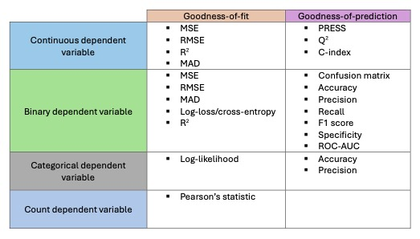
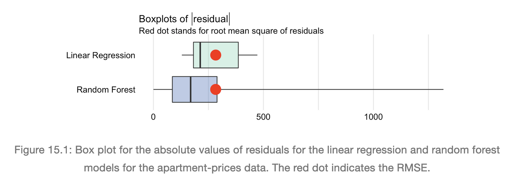
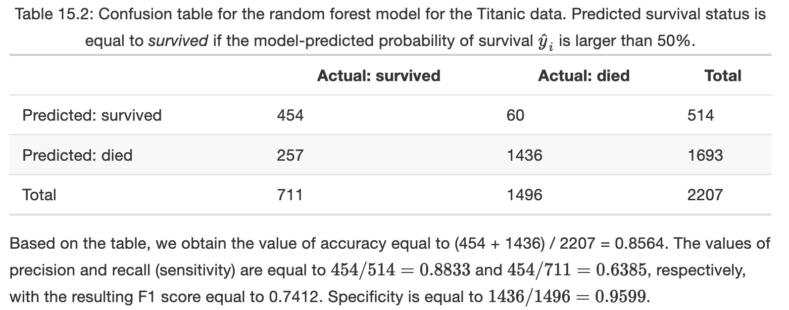
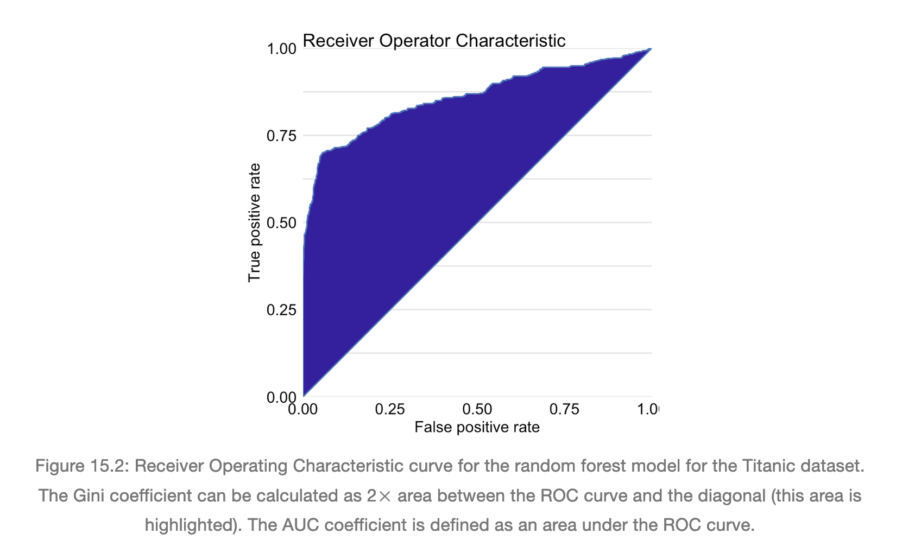
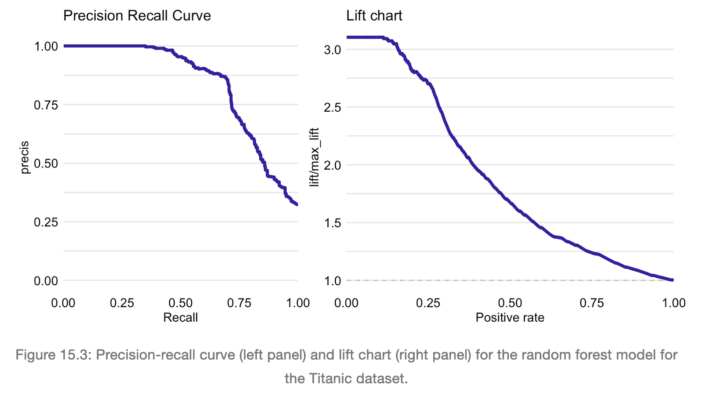
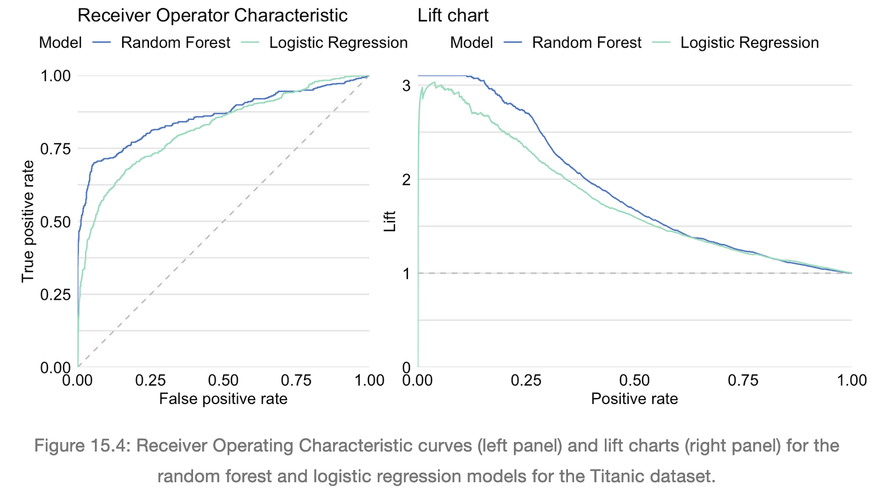

# Model-performance Measures

**Learning objectives:**

-  Model performance measures and evaluation
-  Goodness-of-fit (GoF)
-  Goodness-of-prediction (GoP)

## Introduction

-  Model evaluation (how reliable are the model's predictions?)
-  Model comparison (compare two or more models and decide which is the best model)
-  Out-of-sample and out-of-time comparisons (how the model performs with new, unseen data)

## Method



## Example: Apartment prices



## Example: Titanic data









## Pros and cons

Pros

-   Most used continuous dependent variable metrics (RMSE, MAD, $R^2$) provide a fairly simple way to compare the suitability of predicted and actual values.

 -  For binary/categorical dependent variables, the use of ROC-AUC and lift charts provide a comprehensive metric to compare models performance.
 
Cons

-   Some continuous dependent variable mtrics (i.e., RMSE) can be sensitive to outliers.

-   Binary dependent variable metrics can vary on the selected cut-off values used for creating predictions.

## R code snippetts

Let's retrieve the `titanic_imputed` dataset, and the `titanic_lmr` and `titanic_rf` models.
```{r 15-load-objects}
titanic_imputed <- archivist::aread("pbiecek/models/27e5c")
titanic_lmr <- archivist::aread("pbiecek/models/58b24")
titanic_rf <- archivist::aread("pbiecek/models/4e0fc")
```

Construct the explainers
```{r 15-construct-explainers}
library("rms")
library("randomForest")
library("DALEX")

# explain_lmr <- explain(model = titanic_lmr, 
#                        data = titanic_imputed[, -9],
#                        y = titanic_imputed$survived == "yes", 
#                        type = "classification",
#                        label = "Logistic Regression")
explain_lmr <- readRDS("./explainers/explain_lmr.rds")

# explain_rf <- explain(model = titanic_rf,  
#                       data = titanic_imputed[, -9],
#                       y = titanic_imputed$survived == "yes", 
#                       label = "Random Forest")
explain_rf <- readRDS("./explainers/explain_rf.rds")
```

Function `model_performance()` calculates, by default, a set of selected model-performance measures.

```{r 15-model-performance-rf}
(eva_rf <- DALEX::model_performance(explain_rf))
```

```{r 15-model-performance-lmr}
(eva_lr <- DALEX::model_performance(explain_lmr))
```

Plot the residual histograms and precision-recall curves for both models.
```{r 15-plots}
library("patchwork")

p1 <- plot(eva_rf, eva_lr, geom = "histogram")
p2 <- plot(eva_rf, eva_lr, geom = "prc")

p1 + p2
```

### Cohort 1 {-}

`r knitr::include_url("https://www.youtube.com/embed/URL")`

<details>
<summary> Meeting chat log </summary>

```
LOG
```
</details>
