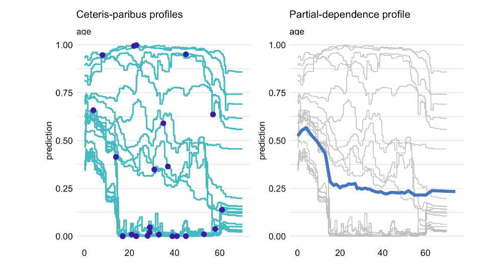
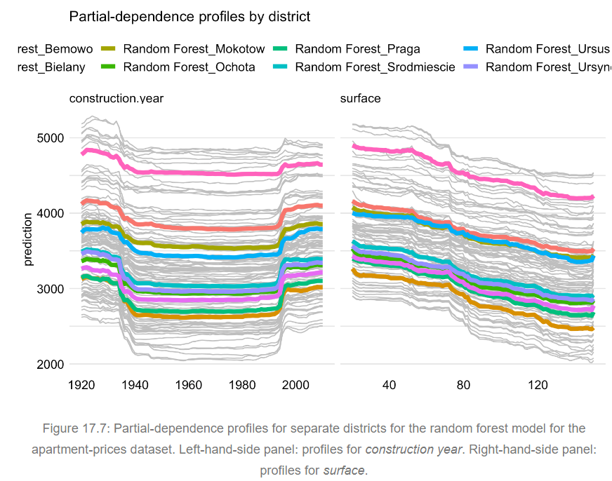

# Partial-dependence Profiles

**Sections:**

-   Overview\
-   Intuition\
-   Method\ 
-   Feature Importance\
-   Example Apartment Prices\
-   Pros and Cons\
-   R Examples

## Overview {.unnumbered}

-   This chapter focuses on partial dependence plots (PDP), also referred to as partial- dependence (PD) profiles.\
-   Extremely popular technique as global model explainer\
-   Available in multiple packages such as `DALEX`, `iml`, and `pdp`, and `PDPbox`\
-   Core idea: PDP plots show how model predictions change as a function of an explanatory variable\
-   Can be produced used on all observations or focusing on key subsets\
-   Useful for comparing multiple models:
    -   Agreement between profiles establishes confidence
    -   Disagreement may suggest a way to improve a model\
    -   Evaluation of model performance at boundaries

## Intuition {.unnumbered}

-   PD profile is constructed by taking arithmetic average of individual ceteris-paribus (CP) profiles.
-   From previous chapter, recall that CP profiles show instance level model prediction behavior based on varying values of an explanatory variable
-   When model is additive, CP profiles for all instances are parallel with the same shape.
-   If model includes interactions, CP profiles may not be parallel

*Example plots using rf model on titanic dataset* 

Note: A chart with all CP profiles plotted together is referred to as an individual conditional explanation (ICE) plot.

## Method {.unnumbered}

### Basic Equations {.unnumbered}

Mathematical representation of PD profile value for model *f()*, variable *j* at value *z*: $$g_{PD}^{j}(z) = E_{\underline{X}^{-j}}\{f(X^{j|=z})\}$$

where $\underline{X}^{-j}$ refers to joint distribution of all explanatory variables other than $X^J$

We rarely know true distribution of $\underline{X}^{-j}$, so we typically estimate using the empirical distribution in our training data:

$$\hat g_{PD}^{j}(z) =  \frac{1}{n} \sum_{i=1}^{n} f(\underline{x}_i^{j|=z}).$$

The above equation refers to the mean of CP profiles for $X^J$

### Clustered partial-dependence profiles {.unnumbered}

-   Mean of CP profiles might not be a good representation if profiles are not parallel.\
-   Alternative approach would be to create multiple clusters of CP profiles:
    -   Use K-means or hierarchical clustering to identify clusters\
    -   Can use Euclidean distance between CP profiles for identifying similar instances

*Example clustered PDP using rf model on titanic dataset* 

### Grouped partial-dependence profiles {.unnumbered}

-   We can use grouped PDPs if we can explicitly identify features that influence the shape of the CP profile for the explanatory variable of interest
-   Obvious use case is when model includes interaction between variable of interest and another one.

*Example grouped PDP using rf model on titanic dataset*    
  
### Contrastive partial-dependence profiles {-}  
  
We can plot PD profiles for multiple models together on same chart.

*Example grouped PDP using rf model on titanic dataset* 

## Feature Importance {-}  
  
This section references Section 8.1.1 of Christopher Molnar's [Interpretable Machine Learning](https://christophm.github.io/interpretable-ml-book/pdp.html) book 

Can measure partial dependence-based feature importance as follows:

$$I(x_S) =  \sqrt{\frac{1}{K-1}\sum_{k=1}^K(\hat{f}_S(x^{(k)}_S) - \frac{1}{K}\sum_{k=1}^K \hat{f}_S({x^{(k)}_S))^2}}$$
where $x^{(k)}_S$ are K unique values of feature $X_S$

Formula calculates variation of PD profile values around average PD value.  
  
Main idea: A flat PD profile indicates a feature that is not important.  

Limitations:  

- Only captures main effects, ignores feature interactions  
- Defined over unique values over the explanatory variable. A unique feature with just one instance is given equal weight to a value with many instance.  
  

  


## Example: apartment-prices data {.unnumbered}

In this section, we use a random forest model to predict price per square meter for an apartment. Focus on two variables, *surface* and *construction year*

### Partial-dependence-profiles {-}  


### Clustered partial-dependence profiles {-}  


### Grouped partial-dependence profiles {-}  
  
In this example, we use *district* as grouping variable to see if relationship between model's prediction with construction year and surface is similar in different geographic areas.

\  
  
### Constrastive partial-dependence profiles {-}  
  

Below we compare the PDP output for from two predictive models: a basic linear regression model and the random forest model.


## Pros and Cons {.unnumbered}

| Pros                                                                            | Cons                                                                                                             |
|------------------------------|------------------------------------------|
| Popular, well-understood in DS community                                        | Maximum number of features in plot is two                                                                        |
| Simple, intuitive way to summarize effect of feature on target variable         | Assumption of independence; problematic with correlated explanatory variables                                    |
| Multiple software packages in R and Python; also easy to implement from scratch | Heterogeneous effects may be hidden in basic PDP plot; may need grouped or clustered profiles for better insight |
| Can be used to assess variable importance                                       | Can be time-consuming to run for medium and large datasets; likely need to use samplse                           |
| Calculation has a casual interpretation for the model of interest.              | Can be misleading in areas where data are sparse in the training sample                                          |

  
**Note:**  
  
- Pros/Cons above reference both the EMA text as well as Christopher Molnar's Interpretable ML book: <https://christophm.github.io/interpretable-ml-book/pdp.html>

## Code Snippets in R {.unnumbered}

We use the titanic dataset and a random forest model.

```{r 17-load-data, warning=FALSE, message=FALSE, results='hide'}
library("DALEX")
library("randomForest")
titanic_imputed <- archivist::aread("pbiecek/models/27e5c")
titanic_rf <- archivist::aread("pbiecek/models/4e0fc")
explainer_rf <- DALEX::explain(model = titanic_rf,  
                               data = titanic_imputed[, -9],
                               y = titanic_imputed$survived, 
                               label = "Random Forest")
```

### Partial-dependence profiles {-}   

```{r pdp, warning=FALSE, message=FALSE}
library("ggplot2")
pdp_rf <- model_profile(explainer = explainer_rf, variables = "age")
plot(pdp_rf) +  ggtitle("Partial-dependence profile for age") 

```

-   Only need to supplier explainer and variable arguments
-   Optional argument `N` allows you to vary the sample size used for calculation, default is 100
-   We can specify specific grouping variables if creating grouped PDP
-   We can also create clustered PDP by specifying the `k` argument for number of clusters. Uses hierarchical clustering under the hood.

We can include CP profiles (i.e. an ICE plot) with an additional argument to `plot()`:

```{r pdp-ice}
plot(pdp_rf, geom = "profiles") + 
    ggtitle("Ceteris-paribus and partial-dependence profiles for age") 

```

### Clustered partial-dependence profiles {.unnumbered}

This uses `hclust()` function:

```{r clustered-pdp, warning=FALSE,message=FALSE}
pdp_rf_clust <- model_profile(explainer = explainer_rf, 
                              variables = "age", k = 3)

plot(pdp_rf_clust, geom = "profiles") + 
    ggtitle("Clustered partial-dependence profiles for age")

```

Grouped partial dependence profiles {-}

Below we group by `gender`:

```{r grouped-pdp, message=FALSE, warning=FALSE}
pdp_rf_gender <- model_profile(explainer = explainer_rf, 
                               variables = "age", groups = "gender")

plot(pdp_rf_gender, geom = "profiles") + 
    ggtitle("Partial-dependence profiles for age, grouped by gender") 

```

### Contrastive partial-dependence profiles {.unnumbered}

```{r contrastive-pdp, warning=FALSE,message=FALSE,results='hide'}
library("rms")
titanic_lmr <- archivist::aread("pbiecek/models/58b24")
explainer_lmr <- DALEX::explain(model = titanic_lmr, 
                                data = titanic_imputed[, -9],
                                y = titanic_imputed$survived, 
                                label = "Logistic Regression")

pdp_lmr <- model_profile(explainer = explainer_lmr, variables = "age")
pdp_rf <- model_profile(explainer = explainer_rf, variables = "age")

plot(pdp_rf, pdp_lmr) +
    ggtitle("Partial-dependence profiles for age for two models") 


```


## Meeting Videos {.unnumbered}

### Cohort 1 {.unnumbered}

`r knitr::include_url("https://www.youtube.com/embed/URL")`

<details>

<summary>Meeting chat log</summary>

```         
LOG
```

</details>
