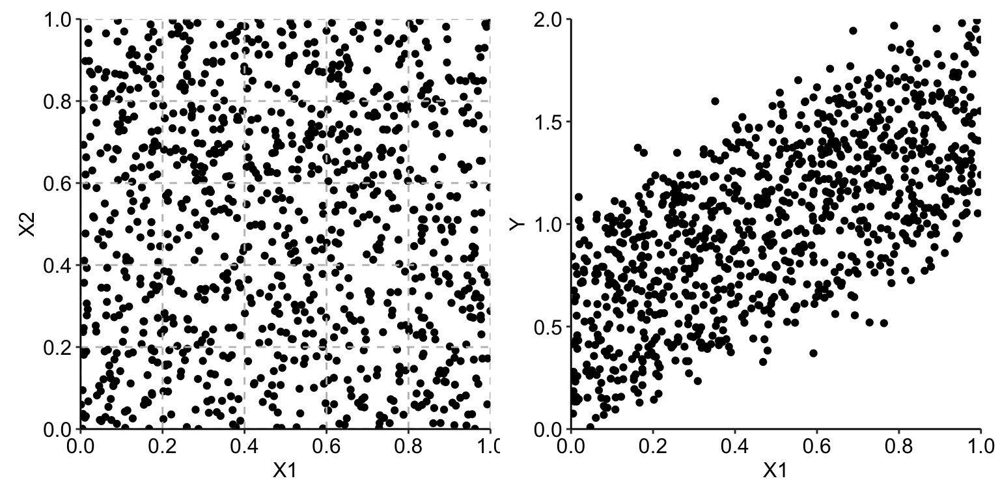
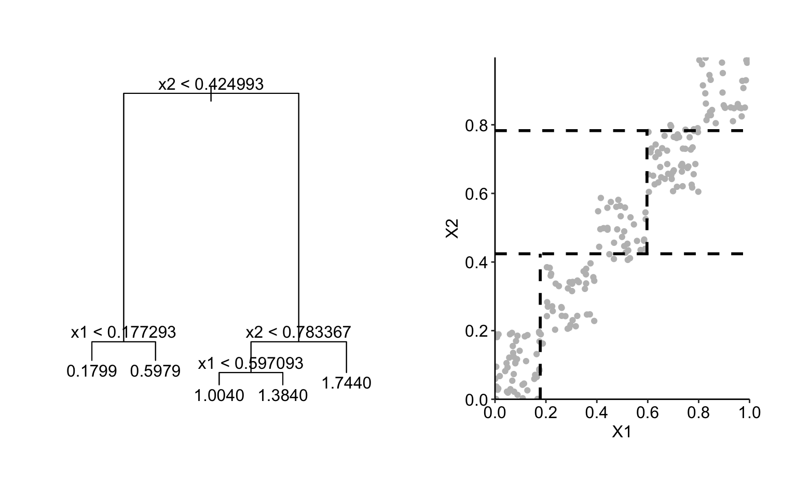
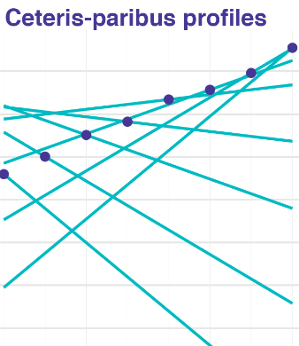
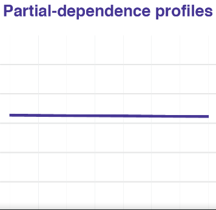
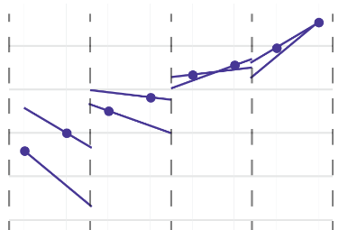
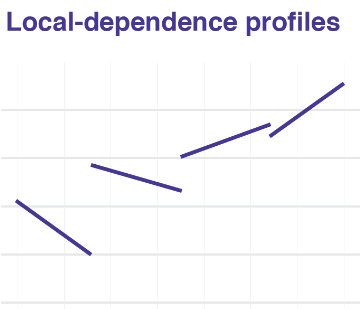
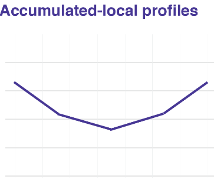
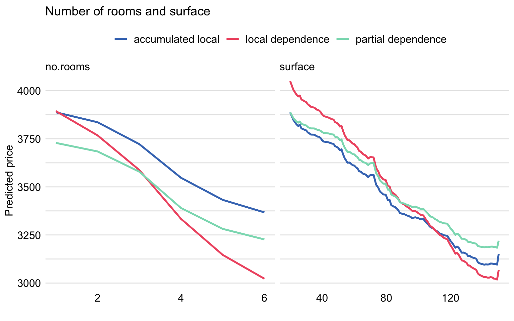

---
output:
  word_document: default
  html_document: default
  pdf_document: default
editor_options:
  chunk_output_type: console
---
# Local-dependence and Accumulated-local Profiles

**Learning objectives:**

* Understand the limitations of Partial-dependence (PD) profiles when dealing with correlated dependent variables.
* Grasp the concept of Local-dependence (LD) profiles and their ability to address the shortcomings of PD profiles in specific scenarios.
* Be familiar with Accumulated-local (AL) profiles and their role in summarizing the effect of a variable while averaging out the effects of other variables in additive models.
* Learn how to identify interactions between explanatory variables by comparing PD, LD, and AL profiles.
* Gain insights into interpreting the profiles and drawing conclusions about the relationships between variables in a model.
* Be introduced to the `DALEX` package as a tool for calculating these profiles and the `model_profile` function for different profile types.


## Partial-dependence (PD) profiles {-}

**Pros**

- The mean of ceteris-paribus (CP) profiles
- Easy to explain and interpret

**Cons**

- They can be misleading if some dependent variable are **correlated**.
  - In the apartment-prices dataset, *surface* and *number of rooms* are **positive correlated**.
  - In the Titanic dataset, *fare* and *class* are **positive correlated**.
  
<br>

**Accumulated-local profiles address this issue**.


## Describing the problem - Linear Example {-}

Simple linear model with two explanatory variables

\begin{equation}
Y = X^1 +  X^2 + \varepsilon = f(X^1, X^2) + \varepsilon
\end{equation}

where $\varepsilon \sim N(0,0.1^2)$



## Describing the problem - Linear Example {-}

Simple linear model with two explanatory variables

```{r}
set.seed(21965)

x1 <- runif(1000)
x2 <- runif(1000)
ex <- rnorm(1000, mean=0, sd=0.1)
yx <- x1+x2+ex
```

Defining the group for each point.

```{r}
br <- c(0,.2,.4,.6,.8,1)
x1c <- cut(x1,breaks = br)
x2c <- cut(x2,breaks = br)
```


##  Describing the problem - Linear Example {-}

Creating a matrix of means for each combination.

```{r}
y_mean_matrix <-
  tapply(yx, list(x1c,x2c), mean) |>
  round(digits = 2)

y_mean_matrix
```

##  Describing the problem - Linear Example {-}

Counting the number of observations of each group.

```{r}
( count_matrix <- table(x1c, x2c) )
```


##  Describing the problem - Linear Example {-}

Counting the number of observations of each group of $X^1$.

```{r}
( x1_dist_matrix <- colSums(count_matrix) / sum(count_matrix) )
```

PD profile for $X^1$ (*expected value*).

```{r}
linear_profiles <- (y_mean_matrix %*% x1_dist_matrix) |> round(digits = 1)

colnames(linear_profiles) <- "profiles"

linear_profiles
```

##  Describing the problem - Linear Example {-}

We could describe the profile by the linear function $0.5+z$.

```{r}
linear_profiles |>
  transform(linear_mid_points = c(0.1, 0.3, 0.5, 0.7, 0.9)) |>
  transform(profile_aprox = 0.5 + linear_mid_points)
```


##  Describing the problem - Linear Example {-}

Let's now subset the values that fit in same groups for $X^1$ and $X^2$.

```{r}
same_group_df <- 
  data.frame(x1,x2,ex,yx,x1c,x2c) |>
  subset(x1c==x2c)
```

Now if we calculate the mean we have many missing values.

```{r}
same_group_y_mean_matrix <-
  with(same_group_df,
       tapply(yx, list(x1c,x2c), mean)) |>
  round(digits = 2)

same_group_y_mean_matrix
```

##  Describing the problem - Linear Example {-}

To make possible the calculation, we copy the value obtained for each range of $X^1$.

```{r}
same_group_y_mean_filled <-
  colSums(same_group_y_mean_matrix, na.rm = TRUE) |>
  matrix(nrow = 5, ncol = 5, byrow = TRUE)

same_group_y_mean_filled
```

##  Describing the problem - Linear Example {-}

Counting the number of observations of each group.

```{r}
same_group_count_matrix <- 
  with(same_group_df,
       table(x1c, x2c))

same_group_count_matrix
```


##  Describing the problem - Linear Example {-}

Counting the number of observations of each group of $X^1$.

```{r}
same_group_x1_dist_matrix <-
  colSums(same_group_count_matrix) /
  sum(same_group_count_matrix)

round(same_group_x1_dist_matrix, 2)
```

##  Describing the problem - Linear Example {-}

PD profile for $X^1$ (*expected value*).

```{r}
(same_group_y_mean_filled %*% same_group_x1_dist_matrix) |> round(digits = 2)
```

**Now, the obtained profile indicates no effect of X1**, which is not true.


##  Describing the problem - Tree Example {-}

The tree is **over estimating** $Y$ for $x^1 \in [0,0.2]$ and $x^2 \in [0.8,1]$ as it is projecting **1.74** where the true value of $Y$ is **1** the prior model could predict **0.99**.

```{r}
library(tree)

tree_model <- tree(yx ~ x1 + x2, data = same_group_df)
```





##  Describing the problem - Tree Example {-}

Defining the new breaks for $X^1$ based on the `tree` model.

```{r}
tree_x1_breaks <-
  tree:::labels.tree(tree_model) |>
  grep(pattern = "^x1", value = TRUE) |> 
  sub(pattern = "x1 (<|>) ", replacement = "") |> 
  as.double() |>
  unique() |>
  c(0, a = _ ,1) |>
  unname()

round(tree_x1_breaks, 2)
```

##  Describing the problem - Tree Example {-}

PD profile for $X^1$ for the regression `tree`.

```{r}
tree_pdp <-
  same_group_df |>
  transform(tree_hat = predict(tree_model),
            x1c_tree = cut(x1, tree_x1_breaks)) |>
  aggregate(x = tree_hat ~ x1c_tree,
            FUN = \(x) mean(x) |> round(digits = 1))

names(tree_pdp)[2] <- "profile"

tree_pdp
```

##  Describing the problem - Tree Example {-}

Based on the mid point of each break, we can approximate the profiles using the function $2z$, with a **slope larger than the true value of 1**.

```{r}
tree_pdp |>
  transform(tree_mid_point = c(0.1, 0.4, 0.8)) |>
  transform(profile_aprox = 2 * tree_mid_point)
```

## Local-dependence profile {-}

Represent the expected value of the model $f$ over the conditional distribution of $\underline{X}^{-j}$ **given** $X^j = z$

\begin{equation}
g_{LD}^{f, j}(z) = E_{\underline{X}^{-j}|X^j=z}\left\{f\left(\underline{X}^{j|=z}\right)\right\}
\end{equation}

This functions works really with if $X^j$ is a categorical variable, but if it continues we can next equation based on $N_j$ defined as the **set of observations** with the value of $X^j$ **close** to $z$.

\begin{equation}
\hat g_{LD}^{j}(z) = \frac{1}{|N_j|} \sum_{k\in N_j} f\left(\underline{x}_k^{j| = z}\right)
\end{equation}

## Smooth boundaries between $N_j$ subsets {-}

If we want smooth boundaries, we need **stop assuming that all predictions have the same impact** in the local-dependence profile.

To solve this we use the function $w_i(z)$ to capture the **distance** between $z$ and $x_i^j$ based on the **density function of a normal distribution** with mean $0$ and standard deviation $s$.

$s$ **plays the role of a smoothing factor.**

\begin{equation}
w_i(z) = \phi(z - x_i^j, 0, s)
\end{equation}

Now we just to apply the next function.

\begin{equation}
\tilde g_{LD}^{j}(z) = \frac{1}{\sum_k w_{k}(z)} \sum_{i = 1}^n w_i(z) f\left(\underline{x}_i^{j| = z}\right)
\end{equation}


## LDP correlation problem {-}

If we have the next case:

- $X^1$ has a uniform distribution on $[0,1]$
- Explanatory variables are perfectly correlated $X^1=X^2$

<br>

And we calculate the LDP for $X^1$ function:

$$
g_{LD}^{1}(z) = E_{X^2|X^1=z}(z+X^2) = z + E_{X^2|X^1=z}(X^2) = 2z.
$$

**The value reported is twice larger than the correct one.**


## Accumulated-local profile {-}

Suppose that we know $f()$, then we can calculate calculate the **Partial Derivative** base on any dependent variable $X^j$ at a specific point $\underline{u}$ to describe the local effect (change) of the model due to $X^j$.

$$
q^j(\underline{u})=\left\{ \frac{\partial f(\underline{x})}{\partial x^j} \right\}_{\underline{x}=\underline{u}}.
$$

And define the **accumulated-local (AL) profile** which measures the accumulated effect of changing $X^j$ from $z_0$ (near the lower bound of $X^j$) to $z$, while averaging out the effects of other variables $\underline{X}^{-j}$.

\begin{equation}
g_{AL}^{j}(z) = \int_{z_0}^z \left[E_{\underline{X}^{-j}|X^j=v}\left\{ q^j(\underline{X}^{j|=v}) \right\}\right] dv + c
\end{equation}

**Averaging of the local effects** allows avoiding the issue of capturing the effect of other variables in the profile for a particular variable **in additive models** (without interactions).

## Selecting a c {-}

It is often chosen so that:

$$
E_{X^j}\left\{g_{AL}^{j}(X^j)\right\} = \int g_{AL}^{j}(x) p(X^j = x) dx = 0
$$

This ensures that **the AL profile has an average effect of zero over the distribution of $X^j$**, making it easier to interpret changes relative to this baseline.


## Approximating an AL profile {-}

1. Replace the derivative with a **finite difference of the CP profiles** to remove the effect of all variables other than $X^j$ *(works for models without interactions)*.

$$
q^j(\underline{x}^{j|=v})dv \approx f(\underline{x}^{j|=v+dv})-f(\underline{x}^{j|=v})
$$

2. Consider a partition of the range of observed values $x_{i}^j$ of variable $X^j$ into $K$ intervals.

$$
N_j(k)=\left(z_{k-1}^j,z_k^j\right] \qquad (k=1,\ldots,K)
$$

## Approximating an AL profile {-}

3. Replace the integral in by a summation.

**Normal**

\begin{equation}
\widehat{g}_{AL}^{j}(z) = \sum_{k=1}^{k_j(z)} \frac{1}{n_j(k)} \sum_{i: x_i^j \in N_j(k)} \left\{ f\left(\underline{x}_i^{j| = z_k^j}\right) - f\left(\underline{x}_i^{j| = z_{k-1}^j}\right) \right\} - \hat{c}
\end{equation}

- $n_j(k)$ denote the number of observations $x_i^j$ falling into $N_j(k)$
- The value $z_0^j$ must be just below $\min(x_1^j,\ldots,x_N^j)$ and $z_K^j=\max(x_1^j,\ldots,x_N^j)$
- $k_j(z)$ is the index of interval $N_j(k)$ in which $z$ falls as $z \in N_j\{k_j(z)\}$
- $\hat{c}$ is selected so that $\sum_{i=1}^n \widehat{g}_{AL}^{f,j}(x_i^j)=0$


## Approximating an AL profile {-}

3. Replace the integral in by a summation.

**Smooth**

\begin{equation}
\widetilde{g}_{AL}^{j}(z) = \sum_{k=1}^K \left[ \frac{1}{\sum_{l} w_l(z_k)} \sum_{i=1}^N w_{i}(z_k) \left\{f\left(\underline{x}_i^{j| = z_k}\right) - f\left(\underline{x}_i^{j| = z_k - \Delta}\right)\right\}\right] - \hat{c}
\end{equation}

- $z_k$ ($k=0, \ldots, K$) form a **uniform grid** covering the interval $(z_0,z)$ with step $\Delta = (z-z_0)/K$
- weight $w_i(z_k)$ captures the distance between point $z_k$ and observation $x_i^j$.


## Example with interactions {-}

If we have the next function:

\begin{equation}
f(X^1, X^2) = (X^1 + 1)\cdot X^2
\end{equation}

- $X^1$ and $X^2$ are uniformly distributed over the interval $[-1,1]$
- $X^1$ and $X^2$ are perfectly correlated, i.e., $X^2 = X^1$. 
- The sum of the **8 observed** values is equal to 0. 

| i     | 1  |     2 |     3 |     4 |     5 |     6 |     7 |  8  |
|-------|----|-------|-------|-------|-------|-------|-------|-----|
| $X^1$ | -1 | -0.71 | -0.43 | -0.14 |  0.14 |  0.43 |  0.71 |  1  |
| $X^2$ | -1 | -0.71 | -0.43 | -0.14 |  0.14 |  0.43 |  0.71 |  1  |
| $y$   | 0  | -0.2059 | -0.2451 | -0.1204 |  0.1596 |  0.6149 |  1.2141 |  2  |

## Ceteris-paribus (CP) profiles $X^1$ {-}

We get the CP profiles as straight lines with the slope equal to the value of variable $X^2$.

\begin{equation}
h^{1}_{CP}(z) = f(z,X^2) = (z+1)\cdot X^2
\end{equation}



## Partial-dependence (PD) profile for $X^1$ {-}

As the total effect of $X^2$ is $0$ and $X^1$ presents an interaction with that variable, then the average of CP profiles is $0$.

\begin{equation}
\hat g_{PD}^{1}(z) =  \frac{1}{8} \sum_{i=1}^{8} (z+1)\cdot X^2_{i} = \frac{z+1}{8}  \sum_{i=1}^{8} X^2_{i} = 0
\end{equation}




## Defining local intervals for $X^1$ {-}

Let's start dividing $X^1$ in **4 intervals** ($K=4$) to calculate the expected value of the CP profiles on each group. 



## Local-dependence (PD) profile for $X^1$ {-}

The LD profile for $X^1$ and any $z \in [-1,1]$ is given by

\begin{equation}
g_{LD}^{1}(z) =  z \cdot (z+1)
\end{equation}

To average of predictions over the conditional distribution.



## Accumulated-local (AL) profile for $X^1$ {-}

Another alternative to define the effect of the variable.

\begin{align}
g_{AL}^{1}(z) &= 
\int_{-1}^z E \left[\frac{\partial f(X^1, X^2)}{\partial X^1} | X^1 = v \right] dv \nonumber \\
& = \int_{-1}^z E \left[X^2 | X^1 = v \right] dv = 
\int_{-1}^z v dv =
(z^2 - 1)/2
\end{align}




## Example: apartment-prices data {-}

With the `apartments_rf` we want to predict the **price per square meter** of an apartment and we want to explore the impact of **surface** and **number of rooms**, as they are correlated.

- The LD profiles are **steeper** than the PD profiles.
  - The effect of *surface* includes the effect of **other correlated variables**.
  
- The AL and PD profiles are parallel to each other.
  - Suggest that **the model is additive** for these two explanatory variables.

{width=60% height=60%}

## Interpretation tips {-}

- If the **CP profiles** are parallel and **PD profile** adequately summarizes them:
  - Explanatory variables are independent (not correlated)
  - There are no interactions in the model
  
- By comparing PD, LD, and AL profiles may help in Identifying:
  - Whether explanatory variables are **correlated** (PD vs LD).
  - Whether there are any **interactions** in the model (PD vs AL).
  
- Only the **AL profile** will provide a correct summary of the effect.
  - If the model is **additive**
  - Some explanatory variables are **correlated**
  
When there are **interactions** in the model, **none of the profiles** will provide a correct assessment:
  - Use a generalization of the PD profiles for **two or more dependent** variables.

## `DALEX` as wrapper of `ingredients` {-}

```{r message=FALSE}
library("DALEX")
library("randomForest")
apartments_rf <- archivist::aread("pbiecek/models/fe7a5")
explainer_apart_rf <- DALEX::explain(model = apartments_rf, 
                             data    = apartments_test[,-1],
                             y       = apartments_test$m2.price, 
                             label   = "Random Forest")
```

## model_profile function {-}

It allows the computation of:

- PD (`type = "partial"`)

```{r}
pd_rf <- model_profile(explainer = explainer_apart_rf,
                       type = "partial",
                       variables = c("no.rooms", "surface"))
```

- LD (`type = "conditional"`) 

```{r}
ld_rf <- model_profile(explainer = explainer_apart_rf,
                       type      = "conditional",
                       variables = c("no.rooms", "surface"))
```


- AL (`type = "accumulated"`) 

```{r}
al_rf <- model_profile(explainer = explainer_apart_rf,
                       type = "accumulated",
                       variables = c("no.rooms", "surface"))
```


## Creating LD plot {-}

```{r}
plot(ld_rf) +
  ggplot2::ggtitle("Local-dependence profiles for no. of rooms and surface", "")
```


## Creating AL plot {-}

```{r}
plot(al_rf) +
  ggplot2::ggtitle("Accumulated-local profiles for no. of rooms and surface", "")
```

## Creating all profiles plot {-}

```{r}
pd_rf$agr_profiles$`_label_` = "partial dependence"
ld_rf$agr_profiles$`_label_` = "local dependence"
al_rf$agr_profiles$`_label_` = "accumulated local"

plot(pd_rf, ld_rf, al_rf) 
```

## Meeting Videos {-}

### Cohort 1 {-}

`r knitr::include_url("https://www.youtube.com/embed/URL")`

<details>
<summary> Meeting chat log </summary>

```
LOG
```
</details>
