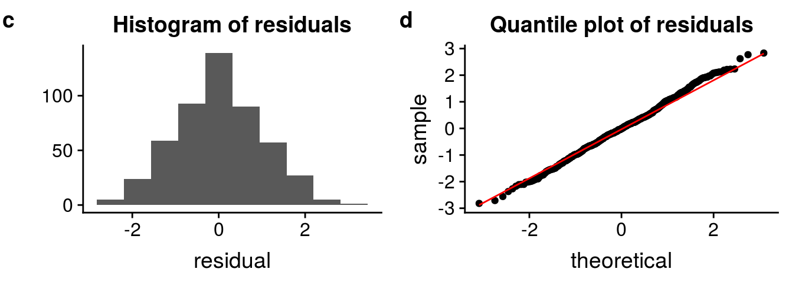
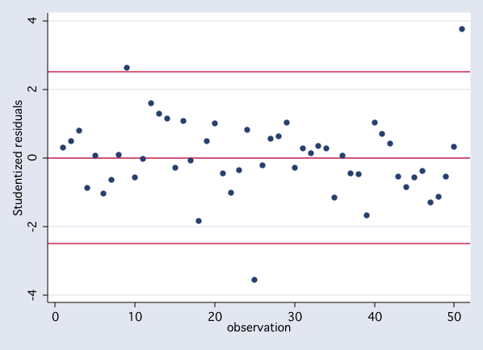
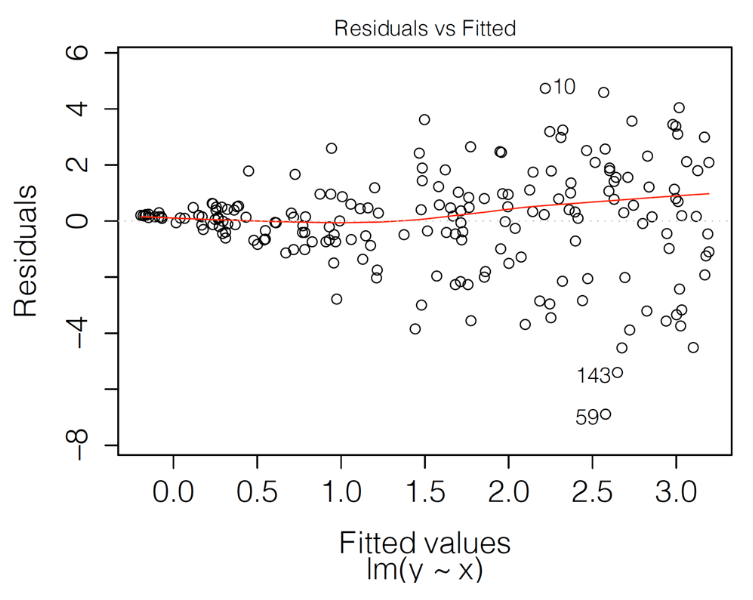
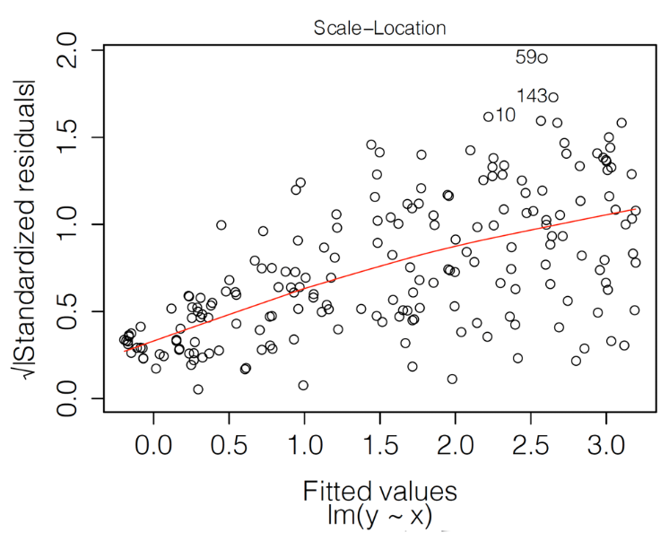
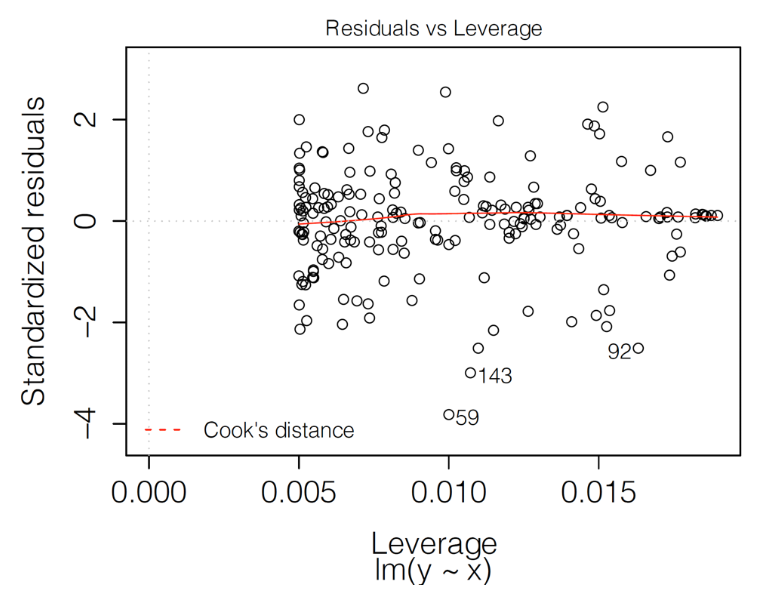
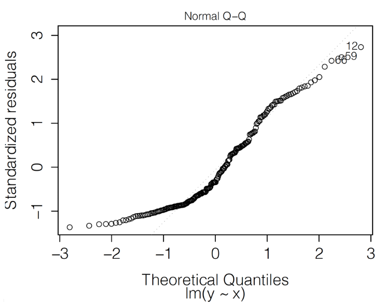

# Residual-Diagnostics Plots

**Learning Objectives:**

This section presents graphical methods for a detailed examination of **model performance** at both **overall** and **instance-specific levels**.

-   Residuals can be utilized to:
    -   **Identify potentially problematic instances**. This can help define which factors contribute most significantly to prediction errors.
    -   **Detect any systematic deviations from the expected behavior** that could be due to:
        -   The omission of explanatory variables
        -   The inclusion of a variable in an incorrect functional form.
    -   **Identify the largest prediction errors**, irrespective of the overall performance of a predictive model.

## Quality of predictions {-}

-   In a **"perfect" predictive model** `predicted value` == `actual value` of the variable for every observation.

-   We want the predictions to be **reasonably close** to the actual values.

-   To quantify the **quality of predictions** we can use the *difference* between the `predicted value` and the `actual value`called as **residual**.

For a continuous dependent variable $Y$, residual $r_i$ for the $i$-th observation in a dataset:

```{=tex}
\begin{equation}
r_i = y_i - f(\underline{x}_i) = y_i - \widehat{y}_i
\end{equation}
```
## Characteristics of a good model {-}

To evaluate a model we need to study the *"behavior" of residuals* for a group of observations. To confirm that:

-   They are **deviating from zero randomly** implying that:
    -   Their distribution should be **symmetric around zero**, so their mean (or median) value should be zero.
    -   Their values most be **close to zero** to show low variability.

## Graphical methods to verify proporties {-}

-   **Histogram**: To check the **symmetry** and **location** of the distribution of residuals *without any assumption*.

-   **Quantile-quantile plot**: To check whether the residuals follow a concrete distribution.



## Standardized *(Pearson)* residuals {-}

```{=tex}
\begin{equation}
\tilde{r}_i = \frac{r_i}{\sqrt{\mbox{Var}(r_i)}}
\end{equation}
```
where $\mbox{Var}(r_i)$ is the **estimated variance** of the residual $r_i$.

| **Model**                         | **Estimation Method**                                        |
|:-------------------------|:---------------------------------------------|
| Classical linear-regression model | The design matrix.                                           |
| Poisson regression                | The expected value of the count.                             |
| Complicated models                | A constant for all residuals.                                |

## Exploring residuals for classification models {-}

-   Due their range ($[-1,1]$) limitations, the residuals $r_i$ are not very useful to explore the probability of observing $y_i$.

-   If **all explanatory variables are categorical** with a limited number of categories the **standard-normal approximation** is likely if follow the following steps:

    -   Divide the observed values in $K$ groups sharing the same predicted value $f_k$.
    -   Average the residuals $r_i$ per group and standardizing them with $\sqrt{f_k(1-f_k)/n_k}$

## Exploring residuals for classification models {-}

In datasets, where different observations lead to **different model predictions** the *Pearson residuals* will **not** be approximated by the **standard-normal** one.

But the **index plot** may still be useful to detect observations with **large residuals**.

{width="45%" height="60%"}

## Exploring residuals for classical linear-regression models {-}

-   Residuals should be normally distributed with mean zero
-   The leverage values from the diagonal of hat matrix $\mathbf{H} = \mathbf{X}(\mathbf{X}^T \mathbf{X})^{-1} \mathbf{X}^T$.

$$
\mathbf{\hat{y}} = 
\mathbf{X}\hat{\beta} = 
\mathbf{X}[(\mathbf{X}^T \mathbf{X})^{-1} \mathbf{X}^T \mathbf{y}] = 
\mathbf{H}\mathbf{y}
$$

-   Expected variance given by: $\text{Var}(e_i) = \sigma^2 (1 - h_{ii})$
-   For independent explanatory variables, it should lead to a constant variance of residuals.

## Residuals $r_i$ in function of predicted values {-}

The plot should show points scattered **symmetrically** around the horizontal **straight line at 0**, but:

-   It has got a shape of a funnel, reflecting **increasing variability** of residuals for increasing fitted values. The variance is not constant *(homoscedasticity violation)*.

-   The smoothed line suggests that the mean of residuals becomes **increasingly positive** for increasing fitted values. The residuals don't seems to have a *zero-mean*.

{width="45%" height="60%"}

## Square root of standardized residuals $\sqrt{\tilde{r}_i}$ in function of predicted values {-}

The plot should show points scattered **symmetrically** across the horizontal axis.

-   The increase in $\sqrt{\tilde{r}_i}$ indicates a violation of the *homoscedasticity assumption*.

{width="45%" height="60%"}

## Standardized residuals $\tilde{r}_i$ in function of leverage $l_i$ {-}

-   **Leverage** $l_i$ is a measure of how far away the **independent variable values** of an observation are from those of the other observations.

-   Data points with **large residuals (outliers)** and/or **high leverage** may distort the outcome and **accuracy of a regression**.

-   The **predicted sum-of-squares**:

```{=tex}
\begin{equation}
PRESS = \sum_{i=1}^{n} (\widehat{y}_{i(-i)} - y_i)^2 =  \sum_{i=1}^{n} \frac{r_i^2}{(1-l_{i})^2}
\end{equation}
```
-   **Cook's distance** measures the effect of deleting a given observation.

{width="45%" height="60%"}

## Standardized residuals $\tilde{r}_i$ in function of leverage $l_i$ {-}

Given that $\tilde{r}_i$ should have approximately **standard-normal distribution**, only about 0.5% of them should be **larger or lower than 2.57**.

If there is an **excess of such observations**, this could be taken as a signal of issues with the **fit of the model**. At least two such observations (59 and 143).

{width="45%" height="60%"}

## Standardized residuals $\tilde{r}_i$ in function of values expected from the standard normal distribution {-}

If the normality assumption is fulfilled, the plot should show a scatter of points close to the $45^{\circ}$ diagonal, but **this not the case**.

{width="45%" height="60%"}

## Apartment-prices: Model Performance {-}

Both models have almost the same performance.

```{r message=FALSE, results='hide'}
library("DALEX")
library("randomForest")


model_apart_lm <- archivist::aread("pbiecek/models/55f19")
model_apart_rf <- archivist::aread("pbiecek/models/fe7a5")


explain_apart_lm <- DALEX::explain(model = model_apart_lm, 
                                   data    = apartments_test[,-1], 
                                   y       = apartments_test$m2.price, 
                                   label   = "Linear Regression")

explain_apart_rf <- DALEX::explain(model = model_apart_rf, 
                           data    = apartments_test[,-1], 
                           y       = apartments_test$m2.price, 
                           label   = "Random Forest")


mr_lm <- DALEX::model_performance(explain_apart_lm)
mr_rf <- DALEX::model_performance(explain_apart_rf)
```

```{r}
list(lm = mr_lm, 
     rf = mr_rf) |>
  lapply(\(x) unlist(x$measures) |> round(4)) |>
  as.data.frame()
```

## Apartment-prices: Residual distribution {-}

-   The distributions of residuals for both models are different.

-   The residuals of **random forest**

    -   They are centered around zero so the predictions are, on average, **close to the actual values**.
    -  The skewness indicates that there are some predictions where the model significantly underestimated the actual values.

-   The residuals of **linear-regression**:

    -  They are splitted into 2 separate normal-like parts, located about -200 and 400, which may suggest the **omission of a binary explanatory variable**.
    
-   **Random forest** residuals seem to be **centered at a value closer to zero** than the distribution for the **linear-regression**, but it shows a larger variation. 

```{r}
plot(mr_rf, mr_lm, geom = "histogram") +
  ggplot2::geom_vline(xintercept = 0)
```

## Apartment-prices: Residual distribution {-}

The RMSE is comparable for the two models as:

- The residuals for the **random forest model are more frequently smaller** than the residuals for the linear-regression model.

- A **small fraction** of the random forest-model residuals is very large.

```{r}
# Run ?DALEX:::plot.model_performance to check documentation
plot(mr_rf, mr_lm, 
     geom = "boxplot",
     show_outliers = 1)
```


## Apartment-prices: Residual distribution {-}

The **linear-regression** model does not capture the **non-linear relationship** between the `price` and the `year of construction`.

```{r}
pdp_lm_year <- model_profile(explainer = explain_apart_lm, 
                             variables = "construction.year")

pdp_rf_year <- model_profile(explainer = explain_apart_rf, 
                             variables = "construction.year")

plot(pdp_rf_year, pdp_lm_year)
```


## Random Forest: Residuals $r_i$ in function of observed values {-}

> The random forest model, as the linear-regression model, assumes that residuals should be homoscedastic, i.e., that they should have a constant variance.

The plot suggests that the predictions are shifted (biased) towards the average.

- For large observed the residuals are positive.
- For small observed the residuals are negative.

```{r}
md_rf <- model_diagnostics(explain_apart_rf)

plot(md_rf, variable = "y", yvariable = "residuals") 
```

> For models like linear regression, such heteroscedasticity of the residuals would be worrying. In random forest models, however, it may be less of concern.

## Random Forest: Predicted in function of observed values {-}

The plot suggests that the predictions are shifted (biased) towards the average.

- For large observed the residuals are positive.
- For small observed the residuals are negative.

```{r}
plot(md_rf, variable = "y", yvariable = "y_hat") +
  ggplot2::geom_abline(colour = "red", intercept = 0, slope = 1)
```

## Random Forest: Residuals $r_i$ in function of an (arbitrary) identifier of the observation {-}

The plot indicates:

- An **asymmetric** distribution of residuals around zero
- An **excess** of large positive (larger than 500) residuals without a corresponding fraction of negative values.

```{r}
plot(md_rf, variable = "ids", yvariable = "residuals")
```

## Random Forest: Residuals $r_i$ in function of predicted value {-}

It suggests that the predictions are shifted (biased) towards the average.

```{r}
plot(md_rf, variable = "y_hat", yvariable = "residuals")
```

## Random Forest: Absolute value of residuals  in function of the predicted {-}

> Variant of the scale-location plot

- For homoscedastic residuals, we would expect a symmetric scatter around a horizontal line; the smoothed trend should be also horizontal.

- The deviates from the expected pattern and indicates that the variability of the residuals depends on the (predicted) value of the dependent variable.

```{r}
plot(md_rf, variable = "y_hat", yvariable = "abs_residuals")
```

## Pros and cons {-}

- Diagnostic methods based on residuals are a very useful to identify:

    -  Problems with distributional assumptions.
    
    -  Problems with the assumed structure of the model *(in terms of the selection of the explanatory variables and their form)*.
    
    -  Groups of observations for which a model’s predictions are biased.


- It presents the following limitations:

    -  Interpretation of the patterns seen in *graphs may not be straightforward*.
    
    -  It's not be immediately obvious *which element of the model* may have to be changed.

## Meeting Videos {-}

### Cohort 1 {-}

`r knitr::include_url("https://www.youtube.com/embed/URL")`

<details>

<summary>

Meeting chat log

</summary>

    LOG

</details>
