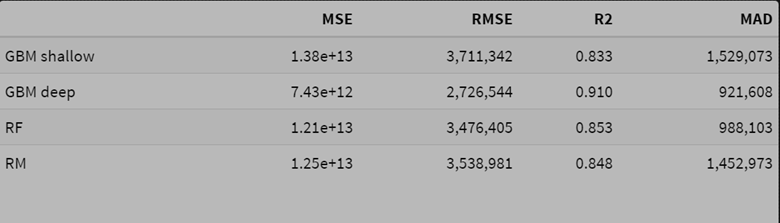
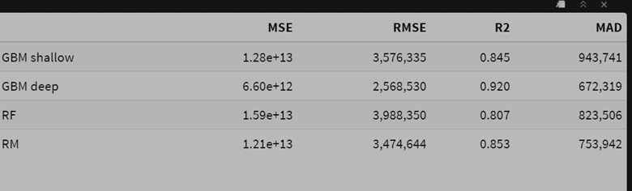
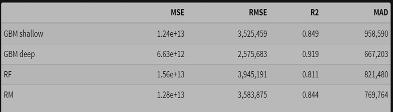

# FIFA 19

**Learning objectives:**

- Case study approach to integrating and reinforcing techniques covered earlier in the text 
- Areas covered:
  * Data exploration and transformation
  * Model building 
  * Graphical and metric-based model evaluation
  * Data set level explanations: permutation feature importance and PD plots
  * Instance level explanations: BD plots, Shapley values, CP profiles, local fidelity plots, local stability plots


## Introduction {-}
  
- In this chapter, we compare different methods directly in the context of a single case study  
- FIFA dataset
  * based on player ratings from EA Sports video game: https://sofifa.com
  * Data extracted and made available on kaggle, although link appears to no longer be valid:
   https://www.kaggle.com/karangadiya/fifa19

## Data preparation {-}  
  
```{r setup, include=FALSE}
knitr::opts_chunk$set(echo = FALSE, message=FALSE, comment = NA,
                      fig.align='center',warning=FALSE,cache=FALSE, fig.width = 12, fig.height = 8)
```
  
```{r libs}
#plots
library(scales)
library(patchwork)
library(GGally)

# ml modeling
library(gbm)
library(ranger)
library(rms)
library(tidymodels)

# XAI
library(DALEX)

# other
library(e1071) # skew func
library(tidyverse)  
library(conflicted)
library(kableExtra)
library(glue)
library(DT)

conflicts_prefer(dplyr::summarize())
```
  
The original dataset had 89 variables and 16,924 players. 

Below is a preview of a slimmed-down version of this dataset used throughout chapter:  
```{r load-data}
glimpse(fifa) 
``` 
  
Note: The `fifa` dataset referenced in the text appears to be different than the one currently available in the DALEX package. For instance, the field naming conventions are different, and the number of dimensions in the `fifa` dataframe do not match the text. We use the `fifa` dataset in the current DALEX package for presentation purposes.   

**Target Variable: Players' Value**  

Player value, `value_eur`, is a heavily skewed variable (skewness value : `r round(skewness(fifa$value_eur),2)`).  
 
We'll apply a log transformation for modeling purposes.  

```{r player-val-plots, echo=FALSE}
p1 <- ggplot(fifa, aes(value_eur)) +
  geom_histogram(bins = 50) +
  theme_drwhy() + 
  scale_x_continuous("Value in Euro", labels = dollar_format(suffix = "€", prefix = "")) + 
  ylab("Number of players with given value") +
  ggtitle("Players' value, original scale","")


p2 <- ggplot(fifa, aes(value_eur)) +
  geom_histogram(bins = 50) +
  theme_drwhy() + 
  scale_x_continuous("Value in Euro", trans = "log10", labels = dollar_format(suffix = "€", prefix = "")) + 
  ylab("Number of players with given value") +
  ggtitle("Players' value, log scale","")

p1 + p2

```
  
**Key Feature Variables**  

Four key variables:  
- `Age` - range is 16-41, symmetric, median/mean is age 27  
- `movement_reactions` - roughly symmetric  
- `skill_ball_control` - bimodal due to lower score distribution for goalkeepers  
- `skill_dribbling` - bimodal due to lower score distribution for goalkeepers  

```{r other-var-plots}
fifa |> 
  select(age,skill_ball_control,skill_dribbling,movement_reactions) |> 
  pivot_longer(everything()) |> 
  ggplot(aes(value)) +
  geom_histogram(bins=25) +
  theme_drwhy() +
  facet_wrap(~name, ncol = 2, scales = "free") +
  ggtitle("Histograms for players' characteristics","") +
  scale_x_continuous("") 
```
  
## Data understanding {-}
  
**Target to Feature Relationships**  

Let's create bivariate plots to get a high-level understanding of the relationship between players' value and our key explanatory variables. Note: player values are plotted on a $log_{10}$ scale  

```{r target-feature-plots}
fifa |> 
  select(age,skill_ball_control,skill_dribbling,movement_reactions,value_eur) |> 
  pivot_longer(cols=-value_eur,names_to="variable") |> 
  ggplot(aes(value, value_eur)) +
  geom_point() + 
  geom_smooth(linewidth = 2, se = FALSE) +
  theme_drwhy() + 
  facet_wrap(~variable, ncol = 2, scales = "free") + 
  scale_y_continuous("Value in Euro", trans = "log10", 
                     labels = dollar_format(suffix = "€", prefix = "")) + 
  scale_x_continuous("") + 
  ggtitle("Scatterplots for players' characteristics","") 
  

``` 

**Feature-Feature Relationships**  
  
Now let's examine the relationship between key explanatory variables. 

```{r feature-feature-plots}
fifa |> 
  select(age,skill_ball_control,skill_dribbling,movement_reactions) |> 
  ggpairs(diag = list(continuous = "barDiag")) +
  theme_drwhy() + 
   ggtitle("Scatterplot matrix for players' characteristics","")
```
  
Observations:  

- Strong correlation between dribbling and ball control  
- Moderate correlation between reactions and other variables  
- Age shows very little correlation with ball control and dribbling   
  
## Model assembly {-}  
  
Process:  

- Set target to log of player value 
- Remove a few variables from dataset for training purposes: `nationality`, `overall`, `potential`, `value_eur`, and `wage_eur` 
- Train four models: deep gbm, shallow gbm, ranger random forest, ols with splines
  
  
Note: The textbook R examples use all fifa records for both training models and creating explainer objects. In our examples, we use a separate training dataset for model creation. We also instantiate model explainers using the test set. This is consistent with the Python-based examples in the text.  

```{r fit-models, echo=TRUE, results='hide'}
# logged target, remove some features 
fifa_small <- fifa |>
   mutate(LogValue = log10(value_eur)) |>
    select(-nationality, -overall,-potential, -value_eur, -wage_eur)

# train test
set.seed(2687)
fs_split <- initial_split(fifa_small, prop = 0.75)
train <- training(fs_split )
test <- testing(fs_split )

# fit models
fifa_gbm_deep <- gbm(LogValue~., data = train, n.trees = 250,
        interaction.depth = 4, distribution = "gaussian")

fifa_gbm_shallow <- gbm(LogValue~., data = train, n.trees = 250,
        interaction.depth = 1, distribution = "gaussian")

fifa_rf <- ranger(LogValue~., data = train, num.trees = 250)

# spline-based formula for ols
ols.formula <- formula(
    paste0('LogValue ~ ',
           paste0(
             paste0("rcs(",names(train)[-length(train)],")"),
             collapse="+")))

fifa_ols <- ols(ols.formula,data = train)

```

Next, create explainer objects.  


```{r build-explainers, echo=TRUE, results='hide'}
# explainer objects
fifa_gbm_exp_deep <- DALEX::explain(fifa_gbm_deep, 
        data = test, y = 10^test$LogValue, 
        predict_function = function(m,x) 10^predict(m, x, n.trees = 250),
        label = "GBM deep")

fifa_gbm_exp_shallow <- DALEX::explain(fifa_gbm_shallow, 
        data = test, y = 10^test$LogValue, 
        predict_function = function(m,x) 10^predict(m, x, n.trees = 250),
        label = "GBM shallow")

fifa_rf_exp <- DALEX::explain(fifa_rf, 
        data = test, y = 10^test$LogValue, 
        predict_function = function(m,x) 10^predict(m, x)$predictions,
        label = "RF")

fifa_rm_exp <- DALEX::explain(fifa_ols, 
        data = test, y = 10^test$LogValue, 
        predict_function = function(m,x) 10^predict(m, x),
        label = "RM")
```  

## Model Audit {-}    
  
**Key performance metrics by model** 
 
The deep GBM model has consistnetly superior metrics on the test set. 
 
```{r model-performance}
fifa_mr_gbm_shallow <- model_performance(fifa_gbm_exp_shallow)
fifa_mr_gbm_deep <- model_performance(fifa_gbm_exp_deep)
fifa_mr_rf <- model_performance(fifa_rf_exp)
fifa_mr_rm <- model_performance(fifa_rm_exp)
perf_mat <- rbind(unlist(fifa_mr_gbm_shallow$measures),
    unlist(fifa_mr_gbm_deep$measures),
    unlist(fifa_mr_rf$measures),
    unlist(fifa_mr_rm$measures))
rownames(perf_mat) <- c("GBM shallow","GBM deep","RF","RM")
colnames(perf_mat) <- c("MSE", "RMSE", "R2", "MAD")

kable(perf_mat,format.args = list(big.mark = ",",digits=3)) |> 
  kable_styling(
    bootstrap_options = c("striped", "hover", "condensed")
  ) 

```
  

**Residual Distribution**  

The deep gbm shows lower variance in residuals, as well as lower median residual values.

```{r resid-boxplot}
plot(fifa_mr_gbm_shallow, fifa_mr_gbm_deep, fifa_mr_rf, fifa_mr_rm, geom = "boxplot") +
  scale_y_continuous("Absolute residuals in Euro", trans = "log10",
                     labels = dollar_format(suffix = "€", prefix = "")) + 
  ggtitle("Distributions of absolute residuals","") 
```

**Predicted vs. Actual Values**    
  
The models tend to overestimate value for less expensive players, and underestimate value for expensive players. 
  
```{r model-diagnostics, fig.width=12, fig.height=8}
fifa_md_gbm_shallow <- model_diagnostics(fifa_gbm_exp_shallow)
fifa_md_gbm_deep <- model_diagnostics(fifa_gbm_exp_deep)
fifa_md_rf <- model_diagnostics(fifa_rf_exp)
fifa_md_rm <- model_diagnostics(fifa_rm_exp)

plot(fifa_md_gbm_shallow, fifa_md_gbm_deep, fifa_md_rf, fifa_md_rm, 
     variable = "y", yvariable = "y_hat") +
  scale_x_continuous("Value in Euro", trans = "log10", 
             labels = dollar_format(suffix = "€", prefix = "")) + 
  scale_y_continuous("Predicted value in Euro", trans = "log10", 
             labels = dollar_format(suffix = "€", prefix = "")) + 
  facet_wrap(~label) +
  geom_abline(slope = 1) + 
  theme(legend.position = "none") +
  ggtitle("Predicted and observed players' values", "") 

```
  

**Example R Code for producing performance metrics and plots**  
  
Below is example R code for producing model performance metrics and plot for the deep gbm model:  

```{r example-perf_metric, echo=TRUE}
model_performance(fifa_gbm_exp_deep)

fifa_md_gbm_deep <- model_diagnostics(fifa_gbm_exp_deep)
plot(fifa_md_gbm_deep, 
     variable = "y", yvariable = "y_hat") +
  scale_x_continuous("Value in Euro", trans = "log10", 
                      labels = dollar_format(suffix = "€", prefix = "")) + 
  scale_y_continuous("Predicted value in Euro", trans = "log10", 
                     labels = dollar_format(suffix = "€", prefix = "")) + 
  geom_abline(slope = 1) + 
  ggtitle("Predicted and observed players' values", "") 

```
 
## Aside on log transformations {-}  

Note: This following material was not discussed in the EMA book.  

Fitting a regression model on a log transformed target variable, then applying the inverse operation on the logged model prediction will result in biased predictions. This may or may not be a problem depending on your goals, loss functions, etc.  
  

**Helpful links:**  
 
Refer to the references below regarding techniques for bias correction when logging the target variable:  
  
- Duan's transformation: https://stats.stackexchange.com/questions/55692/back-transformation-of-an-mlr-model  
- Example of Duan's smearing in python: https://andrewpwheeler.com/tag/linear-regression/
- Alternative smearing adjustment using regression without an intercept:  https://stats.stackexchange.com/questions/361618/how-to-back-transform-a-log-transformed-regression-model-in-r-with-bias-correcti  
- Good discussion on target variable transformation: https://florianwilhelm.info/2020/05/honey_i_shrunk_the_target_variable/  
- Lognormal smearing:  https://en.wikipedia.org/wiki/Smearing_retransformation  
- Forecasting bias: https://arxiv.org/pdf/2208.12264  

  
**Example Bias Adjustment factors using Duan's Transformation**  

Duan's transformation Formula using log base 10:
$$\hat{Y}_j = 10^{(\widehat{\log_{10}{Y}}_j)} \cdot \frac{1}{N}\sum_{i=1}^N 10^{e_i}$$  
where $\widehat{\log_{10}{Y}}_j$ is the model's prediction on the logged scale, and $e_i$ is the model residual on the logged scale (i.e. $log_{10} Y - \widehat{\log_{10}{Y}}_j$). 

```{r smear}
smear.ols <- mean(10^(train$LogValue - predict(fifa_ols,train)))
glue('ols smearing adjustment: {round(smear.ols,3)}')

smear.rf <- mean(10^(train$LogValue - predict(fifa_rf,train)$predictions))
glue('rf smearing adjustment: {round(smear.rf,3)}')

smear.gbm.s <- mean(10^(train$LogValue - predict(fifa_gbm_shallow,train)))
glue('gbm shallow smearing adjustment: {round(smear.gbm.s,3)}')

smear.gbm.d <- mean(10^(train$LogValue - predict(fifa_gbm_deep,train)))
glue('gbm deep smearing adjustment: {round(smear.gbm.d,3)}')
``` 

Below is a comparison of model performance on our test set using three different modeling methodologies:  
  
- Using the raw scale target variable for modeling
- Using the log transformed target for modeling, then taking the inverse
- Using the log transformed target for modeling, then taking the inverse * smearing adjustment  
  




 

Observations:  
  
- The random forest model performs best in terms of squared error on the raw scale.
- The smearing adjustment improves the random forest compared to the basic back-transformed log model.  
- The deep GBM model's MAD value improves slightly with smearing, with a very small deterioration in squared error.  
  
## Dataset-level explanations {-}  

**Permutation-based Importance**  
  
Below are permutation-based importance measures originally introduced in chapter 16.
Here we use the default 10 permutations per model.

```{r feat-import} 
fifa_mp_gbm_shallow <- model_parts(fifa_gbm_exp_shallow)
fifa_mp_gbm_deep <- model_parts(fifa_gbm_exp_deep)
fifa_mp_rf <- model_parts(fifa_rf_exp)
fifa_mp_rm <- model_parts(fifa_rm_exp)

plot(fifa_mp_gbm_shallow, fifa_mp_gbm_deep, fifa_mp_rf, fifa_mp_rm,
     max_vars = 15, bar_width = 4, show_boxplots = FALSE) +
     ggtitle("Feature Importance", "") + theme(axix.text=element_text(size=4))
```

**Partial Dependence Profiles**  
  
```{r fifa-pdp}
selected_variables <- c("movement_reactions", "skill_ball_control", "skill_dribbling", "age")

fifa19_pd_shallow <- model_profile(fifa_gbm_exp_shallow, 
                                   variables = selected_variables)$agr_profiles
fifa19_pd_deep <- model_profile(fifa_gbm_exp_deep, 
                                   variables = selected_variables)$agr_profiles
fifa19_pd_rf <- model_profile(fifa_rf_exp, variables = selected_variables)$agr_profiles
fifa19_pd_rm <- model_profile(fifa_rm_exp, variables = selected_variables)$agr_profiles

plot(fifa19_pd_shallow, fifa19_pd_deep, fifa19_pd_rf, fifa19_pd_rm) +
  scale_y_continuous("Predicted value in Euro", trans = "log10", 
                     labels = dollar_format(suffix = "€", prefix = "")) + 
  ggtitle("Contrastive partial-dependence profiles for selected variables","") 
```

**Sample R Code for Feature Importance and PDP Profiles**  
  
Permutation-based feature importance:  

```{r sample-feat_import, echo=TRUE}
fifa_mp_gbm_deep <- model_parts(fifa_gbm_exp_deep)
plot(fifa_mp_gbm_deep, max_vars = 15, 
     bar_width = 4, show_boxplots = FALSE) 
```
  
PDP Profile:  

```{r sample-pdp, echo=TRUE}
selected_variables <- c("movement_reactions", "skill_ball_control", "skill_dribbling", "age")
fifa19_pd_deep <- model_profile(fifa_gbm_exp_deep, 
                             variables = selected_variables)
plot(fifa19_pd_deep)
```
  
## Instance-level explanations {-}  
  
**Robert Lewandowski**  

Here are player attributes for R Lewankdowski:

```{r RL-attr}
tmp <- data.frame(variable = colnames(fifa_small["R. Lewandowski",]),
           value = round(unlist(fifa_small["R. Lewandowski",])))

datatable(tmp)

```

Now we'll explore instance-level explanations based on the deep GBM model.
  
Break-down plot:  

```{r RL-bdp, echo=TRUE}
fifa_bd_gbm <- predict_parts(fifa_gbm_exp_deep, 
                   new_observation = fifa["R. Lewandowski",],
                   type = "break_down")
plot(fifa_bd_gbm) +
  scale_y_continuous("Predicted value in Euro", 
                  labels = dollar_format(suffix = "€", prefix = "")) + 
  ggtitle("Break-down plot for Robert Lewandowski","") 

```
  
Recall that BD plots are sensitive to the ordering of variables.


Shapley Values:  
```{r RL-shap, echo=TRUE}
fifa_shap_gbm <- predict_parts(fifa_gbm_exp_deep, 
                     new_observation = fifa["R. Lewandowski",], 
                     type = "shap")
plot(fifa_shap_gbm, show_boxplots = TRUE) +
  scale_y_continuous("Estimated value in Euro", 
                   labels = dollar_format(suffix = "€", prefix = "")) + 
  ggtitle("Shapley values for Robert Lewandowski","") 

```
  
Shapley values are not sensitive to variable order.

In this case, there is fairly broad agreement in the top variables across the BD plot and Shapley values.

CP Profiles:

```{r RL-cp, echo=TRUE}
selected_variables <- c("movement_reactions", "skill_ball_control", "skill_dribbling", "age")
fifa_cp_gbm <- predict_profile(fifa_gbm_exp_deep,
                   new_observation = fifa["R. Lewandowski",], 
                         variables = selected_variables)
plot(fifa_cp_gbm, variables = selected_variables)

```

Local fidelity plot:    
  
The distribution between R Lewandowski's neighbors and the total population appears to be different. We see more extreme values among the nearest neighbors compared to the overall population. 

```{r RL-resid-dist, echo=TRUE}
id_gbm <- predict_diagnostics(fifa_gbm_exp_deep, 
                         fifa["R. Lewandowski",],
                         neighbors = 30)
id_gbm 

plot(id_gbm)
```  
  
Local Stability plot for age:  
  
CP profiles among similar players share a similar relationship between value and age.

```{r RL-local-stab, echo=TRUE}
id_rf_age <- individual_diagnostics(fifa_gbm_exp_deep, fifa_small["R. Lewandowski",],
                          neighbors = 30, variables = "age")

plot(id_rf_age) +  
  scale_y_continuous("Estimated value in Euro", trans = "log10", 
                     labels = dollar_format(suffix = "€", prefix = "")) +   
  ggtitle("Local-stability plot for Robert Lewandowski", "") 


```
Note: The book chapter provides instance-level explanations for a couple of other players: Christiano Ronaldo (CR7) and Wojciech Szczesny.  

For the sake of brevity we'll look at one more player, Lionel Messi, as the book suggested this player as an additional exercise. Code snippets are hidden.  
  
  
**Lionel Messi**  

Lionel Messi's attributes:

```{r LM-attr}
tmp.LM <- data.frame(variable = colnames(fifa_small["L. Messi",]),
           value = round(unlist(fifa_small["L. Messi",])))

datatable(tmp.LM)
```   

  
Break-down plot:  

```{r LM-bdp}
fifa_bd_gbm <- predict_parts(fifa_gbm_exp_deep, 
                   new_observation = fifa["L. Messi",],
                   type = "break_down")
plot(fifa_bd_gbm) +
  scale_y_continuous("Predicted value in Euro", 
                  labels = dollar_format(suffix = "€", prefix = "")) + 
  ggtitle("Break-down plot for Lionel Messi","") 

```

Shapley Values:  
```{r LM-shap}
fifa_shap_gbm <- predict_parts(fifa_gbm_exp_deep, 
                     new_observation = fifa["L. Messi",], 
                     type = "shap")
plot(fifa_shap_gbm, show_boxplots = TRUE) +
  scale_y_continuous("Estimated value in Euro", 
                   labels = dollar_format(suffix = "€", prefix = "")) + 
  ggtitle("Shapley values for Lionel Messi","") 

```


CP Profiles:

```{r LM-cp}
selected_variables <- c("movement_reactions", "skill_ball_control", "skill_dribbling", "age")
fifa_cp_gbm <- predict_profile(fifa_gbm_exp_deep,
                   new_observation = fifa["L. Messi",], 
                         variables = selected_variables)
plot(fifa_cp_gbm, variables = selected_variables)

```
  
Local fidelty plot:  

```{r LML-resid-dist}
id_gbm <- predict_diagnostics(fifa_gbm_exp_deep, 
                         fifa["L. Messi",],
                         neighbors = 30)
id_gbm 

plot(id_gbm)
```  
  
**Local stability plot for age**  
  
```{r LM-local-stab}
id_rf_age <- individual_diagnostics(fifa_gbm_exp_deep, fifa_small["L. Messi",],
                          neighbors = 30, variables = "age")

plot(id_rf_age) +  
  scale_y_continuous("Estimated value in Euro", trans = "log10", 
                     labels = dollar_format(suffix = "€", prefix = "")) +   
  ggtitle("Local-stability plot for Lionel Messi", "") 


```  
  
## Meeting Videos {-}  
  
### Cohort 1 {-}

`r knitr::include_url("https://www.youtube.com/embed/URL")`

<details>
<summary> Meeting chat log </summary>

```
LOG:

00:08:43    Aaron G:    start
01:02:35    Aaron G:    end

```
</details>
  

