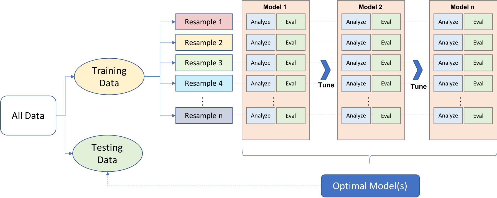

--- 
title: "Explanatory Model Analysis Book Club"
author: "The R4DS Online Learning Community"
date: "`r Sys.Date()`"
site: bookdown::bookdown_site
documentclass: book
bibliography: book.bib
biblio-style: apalike
link-citations: yes
github-repo: r4ds/bookclub-ema
description: "This website is the product of the R4DS Online Learning Community's Explanatory Model Analysis Book Club."
---

# Welcome {-}

Welcome to the Explanatory Model Analysis book club! 

This website is a companion for the book [_Explanatory Model Analysis_](https://ema.drwhy.ai/) by Przemyslaw Biecek and Tomasz Burzykowski (copyright 2021).

You can find this presentation at [r4ds.io/ema](https://r4ds.io/ema).

This website is being developed by the [R4DS Online Learning Community](https://rfordatasci.com). Follow along, and [join the community](https://r4ds.io/join) to participate.

This companion follows the [R4DS Online Learning Community Code of Conduct](https://r4ds.io/conduct).

## Book club meetings {-}

- Each week, a volunteer will present a chapter from the book after assigning it to themselves in the [Volunteers Spreadsheet](https://docs.google.com/spreadsheets/d/1vGnIw4y2QydGYPjUrPJlToawhLpwDpRPj-yjPl2KZIQ/edit#gid=0)
  
-  Presentations: 
   -  Review of material
   -  Questions you have
   -  Maybe live demo
   
- More information about how to present is available at [github.com/r4ds/bookclub-ema](https://github.com/r4ds/bookclub-ema).

- Presentations will be recorded, and will be available on the [R4DS Online Learning Community YouTube Channel](https://r4ds.io/youtube).

## Pace {-}

-  Meet ***every*** week except holidays, etc

-  Meetings = **1 hour.**

-  **Goal:** 1 chapter/week
  -  Ok to split overwhelming chapters
  -  Ok to combine short chapters
  
-  If we need to **slow down** and discuss, **let me know**.
   -  Most likely someone has the same question 
   -  We are all here to learn 
  
   
## Introductions {-}

If you feel comfortable sharing, unmute or raise your hand!

-  **Who** are you?
-  **Where** are you joining from?
-  **Previous clubs?** (R4DS or other)
-  **How long** have you been using R or Python?
-  **What** are you most looking forward to learning?

## Before reading this book {-}

- You should know how to use R or Python

[R for Data Science](https://r4ds.hadley.nz/) | [Python for Data Analysis](https://wesmckinney.com/book/)
:-------------------------:|:-------------------------:
  |  

## Before reading this book {-}

-  You should know how to train, re-sample, evaluate, and tune models by using packages like:
  - `CatBoost`
  - `LightGBM`
  - `XGBoost`
  - `Keras`
  - `H2O`
  - `Tidymodels` or `Scikit-learn`

{width=63.33% height=95% fig-align="center"}

## What will we learn? {-}

- How to determine which **explanatory variables** affect a model's prediction for a **single observation**.
  - Break-down plots
  - Ceteris-paribus profiles
  - Local-model approximations
  - Shapley values;

- Techniques to examine predictive **models as a whole**.
  - Partial-dependence plots
  - Variable-importance plots
  
- **Charts** that can be used to present the key information in a quick way

- Tools and methods for **model comparison**

## What will we learn? {-}

{width=69.69697% height=95% fig-align="center"}

